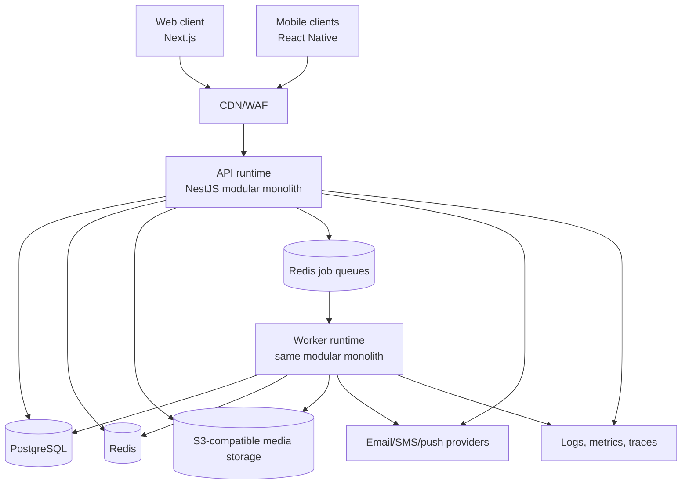
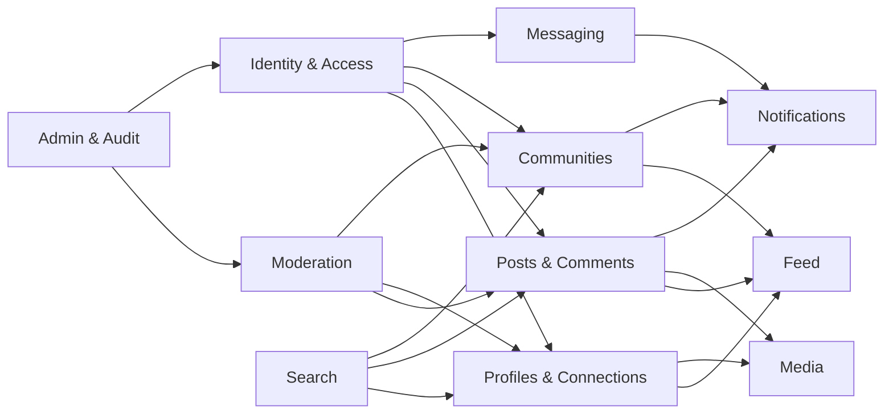
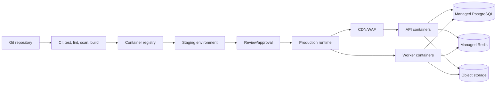

# AfriLink Technical Architecture

**Status:** Draft — pending product and technology-stack approval
**Date:** 2026-09-13
**Scope:** Initial MVP modular monolith; no application code

> **Input status:** The technology stack and modular-monolith constraint are approved in `CLAUDE.md`. `docs/01-product/PRD.md` is empty, so product boundaries and capacity targets remain subject to product approval. This document does not overwrite an approved architecture; the existing target file was empty.

## 1. Architecture goals and constraints

AfriLink is intended to provide social networking infrastructure for African people, communities, creators, and businesses across borders. The first implementation should optimize for:

- a coherent MVP and fast iteration;
- clear module boundaries inside one deployable backend;
- African and cross-border use cases, including localization, low bandwidth, and unreliable connectivity;
- privacy, moderation, and abuse resistance from the beginning;
- a migration path to independently scaled services only when measured load or ownership boundaries justify it.

The architecture explicitly **does not** introduce microservices, event streaming infrastructure, or multiple databases for the MVP.

## 2. Approved technology baseline

These choices are defined by `CLAUDE.md` and guide implementation:

| Concern | Provisional choice | Reason |
|---|---|---|
| Web frontend | Next.js + React + TypeScript | SSR/SEO for public profiles and communities; one typed frontend stack |
| Mobile | React Native with Expo + TypeScript | Shared domain/UI knowledge with web; iOS and Android delivery |
| Backend | NestJS + TypeScript, modular monolith | Explicit modules, validation, dependency injection, and one deployable API |
| Primary database | PostgreSQL | Relational integrity for identity, permissions, moderation, and transactions |
| ORM/migrations | Prisma | Typed access and versioned migrations |
| Cache/queue | Redis + BullMQ | Cache, rate-limit counters, and durable background jobs |
| Object storage | S3-compatible storage | Media durability and CDN integration without storing blobs in PostgreSQL |
| API | Versioned REST/JSON; WebSocket gateway for realtime messaging | Simple mobile/web integration and selective realtime behavior |
| Search | PostgreSQL full-text search initially | Avoid an additional operational dependency; extract later if required |
| Observability | OpenTelemetry, structured logs, metrics, traces | Vendor-neutral instrumentation |
| Delivery | Docker, managed PostgreSQL/Redis/object storage, CDN, CI/CD | Reproducible deployments with low operational overhead |

Any change to this stack requires an architecture decision record that explains the reason and impact.

## 3. System architecture

The system is a modular monolith with one API runtime, one worker runtime from the same codebase, PostgreSQL as the system of record, Redis for ephemeral/derived state, and object storage for media. The web and mobile clients use the same public API.

### Runtime boundaries

1. **Edge:** DNS, TLS, WAF, CDN, request size limits, and basic bot/rate controls.
2. **API runtime:** authentication, authorization, synchronous commands/queries, and WebSocket connections.
3. **Worker runtime:** notifications, media processing, feed fan-out, moderation scans, cleanup, and retries.
4. **Persistence:** PostgreSQL transactions; Redis for derived or short-lived state; object storage for binary assets.
5. **External providers:** email, SMS/OTP, push notification, image/video processing, and optional content-safety providers.

## 4. Frontend architecture

- Organize the web client by feature: identity, profile, feed, post, community, messaging, notifications, search, moderation, and admin.
- Keep server state in a query/cache layer and local UI state in component or feature stores; do not duplicate server truth in global state.
- Use server rendering or static generation for public profiles and public community pages; use authenticated client fetching for private timelines and messages.
- Centralize API client generation, authentication refresh, error mapping, pagination, feature flags, and telemetry.
- Use cursor pagination, image placeholders, responsive layouts, accessible controls, and optimistic updates only for reversible interactions such as likes.
- Enforce authorization on the API; frontend guards are for user experience, not security.

## 5. Mobile architecture

- React Native/Expo application with feature-based modules and shared TypeScript API/domain types where practical.
- Persist only encrypted session material and explicitly offline-safe data; never persist access tokens in ordinary plaintext storage.
- Use a small offline outbox for post reactions, follows, and message sends. Each command needs an idempotency key and a visible retry/conflict state.
- Compress and resumably upload media; defer nonessential media and feed images on metered connections.
- Support deep links for profiles, posts, communities, and conversations.
- Integrate APNs/FCM through a notification abstraction rather than exposing provider details to feature modules.

## 6. Backend architecture

The NestJS application is a single deployable modular monolith. Modules communicate through typed application services and domain events, not direct access to another module's tables.

Recommended layers inside each module:

- **Presentation:** REST controllers, WebSocket handlers, DTO validation, and serializers.
- **Application:** use cases, transaction boundaries, authorization checks, idempotency handling.
- **Domain:** entities, value objects, policies, and domain events.
- **Infrastructure:** Prisma repositories, provider adapters, queue publishers, and storage adapters.

The worker imports application services through the same module boundaries. Jobs are commands with retry policy and idempotency, not arbitrary database scripts.

## 7. Module diagram

### Module ownership rules

| Module | Owns | May publish |
|---|---|---|
| Identity & Access | users, credentials, sessions, roles | `UserRegistered`, `UserSuspended` |
| Profiles & Connections | profiles, follows, blocks | `FollowCreated`, `BlockCreated` |
| Posts & Comments | posts, comments, reactions | `PostPublished`, `CommentCreated` |
| Feed | feed entries, ranking metadata | `FeedRebuildRequested` |
| Communities | communities, memberships, community roles | `MembershipChanged` |
| Messaging | conversations, participants, messages, read state | `MessageSent` |
| Notifications | preferences, in-app notifications, delivery records | `NotificationRequested` |
| Media | assets, variants, upload state | `MediaReady`, `MediaRejected` |
| Moderation | reports, cases, decisions, sanctions | `ContentActioned` |
| Admin & Audit | administrative actions and audit records | `AuditRecorded` |
| Search | search projections/index metadata | `SearchProjectionUpdated` |

## 8. Database architecture

PostgreSQL is the transactional source of truth. Use one database initially, with a schema organized by ownership (`identity`, `social`, `content`, `community`, `messaging`, `notification`, `moderation`, `media`, `audit`, and `search`) or an equivalent table prefix convention.

Core entities:

- `users`, `credentials`, `sessions`, `roles`, `user_roles`;
- `profiles`, `follows`, `blocks`;
- `posts`, `comments`, `reactions`, `post_visibility`;
- `communities`, `community_memberships`, `community_roles`;
- `conversations`, `conversation_members`, `messages`, `message_receipts`;
- `notifications`, `notification_preferences`, `delivery_attempts`;
- `media_assets`, `media_variants`, `upload_parts`;
- `reports`, `moderation_cases`, `moderation_actions`, `audit_events`.

Rules:

- UUID/ULID public identifiers; never expose sequential internal IDs as public identity.
- Foreign keys and unique constraints enforce ownership, membership, and idempotency.
- Soft deletion is explicit and policy-driven; retain minimum audit/legal records separately.
- Store timestamps in UTC; store user locale, language, and timezone as profile preferences.
- Use cursor indexes for `(created_at, id)` and relationship indexes for feed, membership, and messaging queries.
- Use an outbox table in PostgreSQL so committed domain changes reliably produce background jobs.
- Encrypt sensitive fields selectively and keep secrets outside the database.

## 9. API architecture

Use `/api/v1` REST endpoints with consistent envelopes, validation, pagination, and error codes. Use WebSockets only for message delivery, typing/presence where approved, and notification updates; all state changes remain REST/application commands.

Examples of resource areas:

- `/auth`, `/users`, `/profiles`, `/follows`, `/blocks`;
- `/posts`, `/comments`, `/reactions`, `/feed`;
- `/communities`, `/memberships`;
- `/conversations`, `/messages`;
- `/notifications`, `/media/uploads`;
- `/reports`, `/admin`.

API requirements:

- OpenAPI is generated and reviewed as a contract.
- Validate payloads and content types at the edge and controller boundary.
- Use cursor pagination and bounded page sizes.
- Support `Idempotency-Key` on retryable commands, especially uploads, posts, follows, and messages.
- Return generic authentication and authorization errors where disclosure could aid abuse.
- Apply per-user, IP, endpoint, and resource rate limits.
- Version breaking changes; prefer additive changes.

## 10. Authentication architecture

- Use short-lived access tokens and rotating refresh tokens stored server-side as hashes, with device/session revocation.
- Passwords use a memory-hard password hash such as Argon2id; never log credentials or tokens.
- Email/phone verification and OTP flows are separate, rate-limited, single-use, and expiry-bound.
- Add optional MFA for users and mandatory MFA for administrators.
- Use secure, HttpOnly, SameSite cookies for web sessions where appropriate; use OS-protected secure storage for mobile refresh credentials.
- Authorization combines account status, resource ownership, visibility, relationship state, community role, and moderation sanctions.
- Maintain an audit trail for login, credential changes, session revocation, role changes, and admin actions.

## 11. Social graph architecture

Represent follows as a directed edge with uniqueness on `(follower_id, followee_id)`. Blocks are higher-priority negative edges and must suppress profile discovery, feed items, messaging, and notifications according to policy.

- Keep graph mutations transactional and idempotent.
- Maintain counts as derived values; repair them asynchronously from source edges.
- Start with PostgreSQL joins and denormalized counters. Do not add a graph database for the MVP.
- Model privacy states such as public, followers-only, community-only, and private.
- Apply block and moderation filters before ranking or returning content.

## 12. Feed architecture

Use a hybrid feed:

1. Publish a post transactionally and emit `PostPublished` through the outbox.
2. A worker fans out a bounded number of feed entries to active followers and relevant community members.
3. For high-fan-out accounts, use pull-on-read rather than writing to every follower.
4. At read time, merge precomputed entries with pull sources, apply visibility/block/moderation filters, rank, and cursor paginate.

MVP ranking should be deterministic and explainable: recency, relationship strength, community membership, language/region preference, and basic engagement signals. Avoid opaque personalization until data quality, consent, and safety controls are established.

## 13. Messaging architecture

- Conversations and membership are relational; messages are append-only records with sender, client idempotency key, timestamps, and moderation state.
- REST creates messages; WebSockets deliver accepted messages to connected participants. The database remains authoritative.
- Reconnect using a message cursor; clients acknowledge delivery/read separately.
- Presence and typing indicators are ephemeral Redis keys with short TTLs and must not be treated as durable facts.
- Attachments use the Media module and signed upload URLs; messages reference media IDs, not provider URLs.
- Apply block, membership, report, retention, and abuse controls before delivery.

## 14. Notification architecture

Notifications are generated from domain events, deduplicated, preference-filtered, and delivered asynchronously.

- In-app notifications are durable PostgreSQL records.
- Push, email, and SMS are provider adapters with retry/backoff and delivery status.
- Store category, channel, locale, quiet hours, and consent preferences.
- Collapse noisy events, such as repeated reactions, into summaries.
- Never include sensitive message content in push payloads by default.

## 15. Media architecture

1. API authorizes an upload and creates a pending `media_asset`.
2. Client uploads directly to private object storage using a short-lived signed URL.
3. Storage events or a completion call enqueue validation and processing.
4. Workers verify type/size, malware-scan where available, strip unsafe metadata, generate variants/thumbnails, and mark the asset ready or rejected.
5. CDN serves only approved variants through signed or policy-controlled URLs.

Set quotas, content-type allowlists, maximum dimensions, retention policies, and orphan cleanup. Never trust a filename or client MIME type.

## 16. Community architecture

Communities have an owner, moderators, membership policy, visibility, rules, and moderation settings. Membership transitions are stateful and audited.

- Public communities permit discovery; private communities require invitation or approval.
- Community roles are scoped and cannot grant platform-wide privileges.
- Community feeds reuse the Content and Feed modules but apply community visibility and membership filters.
- Moderators can manage community content and members within scope; platform admins handle escalations.

## 17. Moderation architecture

Moderation is a first-class workflow, not only an admin screen.

- Users can report content, profiles, messages, and communities with categorized reasons.
- Reports enter a queue with deduplication, priority, SLA, assignment, evidence, and immutable decision history.
- Automated checks may flag content, but MVP enforcement requires policy-based actions and human review for consequential decisions.
- Actions include label, reduce distribution, remove, restrict, suspend, and ban; every action has actor, reason, scope, duration, and appeal state.
- Preserve evidence access controls and minimize sensitive retention.
- Provide user-facing status and appeal flows where policy requires them.

## 18. Admin architecture

The admin console is a separate frontend area using the same API with stronger authorization and mandatory audit logging.

- Use least-privilege roles: support, moderator, senior moderator, operations, and security administrator.
- Require MFA, recent re-authentication for sensitive actions, scoped permissions, and dual control for irreversible platform actions where feasible.
- Provide case queues, user/content lookup, sanctions, appeals, feature flags, provider health, and audit search.
- Do not allow direct production database editing through the admin UI.

## 19. Security architecture

Apply defense in depth:

- TLS everywhere, secure headers, WAF rules, CSRF protection for cookie-authenticated web commands, and strict CORS.
- Central input validation, output encoding, safe markdown/HTML sanitization, SSRF protection, and upload scanning.
- Secrets in a managed secret store; separate environments and credentials.
- Encryption at rest through managed services and field-level encryption for high-risk data.
- Tenant/resource authorization checks in every use case; test for IDOR and privilege escalation.
- Rate-limit authentication, OTP, posting, messaging, reporting, search, and media operations.
- Minimize PII, define retention/deletion workflows, and document data residency and cross-border transfer requirements.
- Dependency, container, secret, and schema migration scans in CI.
- Incident response includes credential revocation, moderation escalation, evidence preservation, and user communication.

## 20. Caching strategy

Redis is a performance layer, never the source of truth.

- Cache public profile/community summaries, feature flags, permission snapshots, and expensive read models with short TTLs.
- Use namespaced keys, bounded values, jittered TTLs, and explicit invalidation on critical mutations.
- Cache feed pages only when invalidation and privacy filtering are safe; prefer per-user feed entries for consistency.
- Use Redis counters for rate limits and ephemeral presence.
- Prevent cache stampedes with request coalescing or short locks.
- Do not cache private responses across users or before authorization.

## 21. Background-job strategy

Use an outbox publisher plus BullMQ queues. Suggested queues:

- `feed`: fan-out, ranking rebuild, counter repair;
- `notifications`: in-app creation, push/email/SMS delivery;
- `media`: scan, transcode, thumbnail, cleanup;
- `moderation`: automated checks, report prioritization, retention;
- `search`: projection updates and reindexing;
- `maintenance`: expired sessions, orphan cleanup, data repair.

Each job has an idempotency key, retry/backoff policy, timeout, dead-letter handling, metrics, and a runbook. Backpressure and queue lag must be visible before increasing worker concurrency.

## 22. Observability strategy

- Structured JSON logs with request ID, trace ID, actor classification, route, status, latency, and error code; never log secrets or message bodies.
- OpenTelemetry traces across API, database, Redis, queues, storage, and external providers.
- Metrics for latency/error rate, database pool use, cache hit rate, queue lag, job failures, feed generation, upload failures, authentication abuse, and moderation SLAs.
- Dashboards and alerts for availability, saturation, data freshness, provider failures, and security anomalies.
- Define SLOs after product traffic assumptions are known; begin with API availability, p95 latency, job completion, and notification delivery targets.
- Correlate audit events with traces without exposing sensitive content.

## 23. Deployment architecture

Environment separation:

- Local: Docker Compose dependencies and safe development providers.
- CI: ephemeral or isolated test database; migrations and contract tests.
- Staging: production-like configuration and seeded non-PII data.
- Production: private database/network placement, managed backups, point-in-time recovery, autoscaling stateless API/worker containers, and CDN.

Deployment requirements include backward-compatible migrations, health/readiness probes, graceful shutdown, rolling or blue/green release, automated rollback, encrypted backups, restore drills, and infrastructure-as-code. Do not run schema-destructive migrations in the same step as application rollout.

## 24. Data-flow overview

### Publishing a post

1. Client authenticates and sends a validated command with an idempotency key.
2. Content module checks account, community, visibility, and moderation eligibility.
3. PostgreSQL transaction stores the post and an outbox event.
4. API returns the canonical post state.
5. Worker publishes the event, updates feed projections, search projections, notifications, and moderation checks.
6. Clients receive updates through normal polling, refresh, or approved realtime channels.

### Sending a message

1. Client submits a command; Messaging checks membership, blocks, sanctions, and idempotency.
2. PostgreSQL stores the message and outbox event.
3. Worker or gateway delivers to connected recipients and creates notification jobs as allowed.
4. Offline recipients retrieve messages by cursor; delivery/read receipts update independently.

### Uploading media

1. API authorizes and reserves an asset.
2. Client uploads directly to private object storage.
3. Completion triggers validation and processing jobs.
4. Only approved variants become readable through CDN URLs.

## 25. Dependency map

| Dependency | Used by | Failure behavior |
|---|---|---|
| PostgreSQL | All durable modules | API writes fail closed; reads may degrade only for explicitly safe cached data |
| Redis | Cache, rate limits, queues, presence | Rate limits use conservative fallback; durable commands remain in PostgreSQL/outbox |
| Object storage/CDN | Media | Existing content remains referenced; new uploads pause or retry |
| Email/SMS provider | Verification and alerts | Queue and retry; do not block unrelated requests |
| APNs/FCM | Mobile push | Queue/retry; in-app notifications remain available |
| Content-safety provider | Optional moderation signal | Mark pending or route to human review; never silently approve high-risk content |
| CI/container registry | Delivery | Existing release remains running; block unverified deployment |

## 26. Technical risks and mitigations

| Risk | Impact | Mitigation |
|---|---|---|
| No approved stack is recorded | Implementation churn | Confirm choices in `CLAUDE.md`/ADR before coding |
| PRD and discovery inputs are unavailable | Wrong scope and data model | Restore/approve product documents before schema freeze |
| Feed fan-out hotspots | High write volume and stale feeds | Hybrid push/pull, bounded fan-out, queue backpressure, measured ranking |
| Messaging abuse or spam | User harm and provider cost | Rate limits, blocks, reporting, moderation, delivery controls |
| Cross-border privacy obligations | Regulatory exposure | Data inventory, retention policy, residency/legal review |
| Media storage and bandwidth cost | Unpredictable operating cost | Direct uploads, variants, quotas, CDN, lifecycle policies |
| Redis used as truth | Data loss/inconsistency | PostgreSQL authority and outbox pattern |
| Modular monolith coupling | Difficult future scaling | Enforce module ownership, contracts, and dependency rules |
| External provider outage | Broken verification/notifications | Adapter boundaries, retries, fallback channels, status monitoring |
| Admin privilege misuse | Severe security impact | MFA, least privilege, scoped actions, immutable audit trail |

## 27. Scaling considerations

Scale in this order, based on measurements:

1. Add indexes, query budgets, pagination, and connection-pool tuning.
2. Scale stateless API and worker replicas independently.
3. Move read-heavy public data to safe caches and replicas.
4. Partition high-volume tables such as messages, audit events, and feed entries when justified.
5. Separate worker queues by workload and priority.
6. Introduce a search engine only when PostgreSQL search latency or relevance is insufficient.
7. Extract a module into a service only when it has a distinct scaling profile, reliability boundary, ownership team, or deployment cadence that the monolith cannot satisfy.

Potential first extraction candidates are media processing or messaging delivery, not identity or authorization. Extraction requires an ADR, contract tests, event ownership, data migration plan, and operational ownership.

## 28. Open decisions before implementation

1. What is the approved frontend, mobile, backend, database, cloud, and deployment stack?
2. What product scope and acceptance criteria belong in the MVP PRD?
3. Are phone numbers, email, or both required for identity, and which African countries must be supported first?
4. What are the initial languages, currencies, locales, and data-residency constraints?
5. What content types, privacy modes, community modes, and messaging capabilities are in MVP?
6. What moderation policy, appeal process, legal retention, and safety escalation rules apply?
7. Which external providers are approved for OTP, email, push, media processing, and content safety?
8. What traffic, storage, availability, recovery-time, and recovery-point targets should define capacity planning?

## 29. Recommended next steps

1. Restore or approve `docs/01-product/PRD.md` and create/approve `docs/01-product/project-discovery.md`.
2. Record the technology baseline in `CLAUDE.md` or a numbered ADR.
3. Approve MVP boundaries, privacy/moderation policies, and initial countries/languages.
4. Produce the database schema and API contract from the approved MVP.
5. Create ADRs for authentication, feed strategy, media provider, and deployment environment.
6. Only then scaffold the modular monolith and implement vertical slices with tests.
