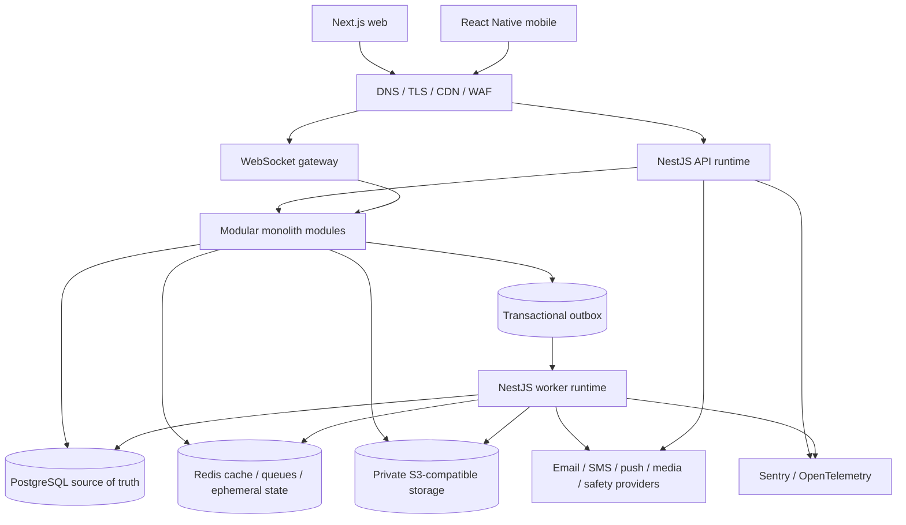
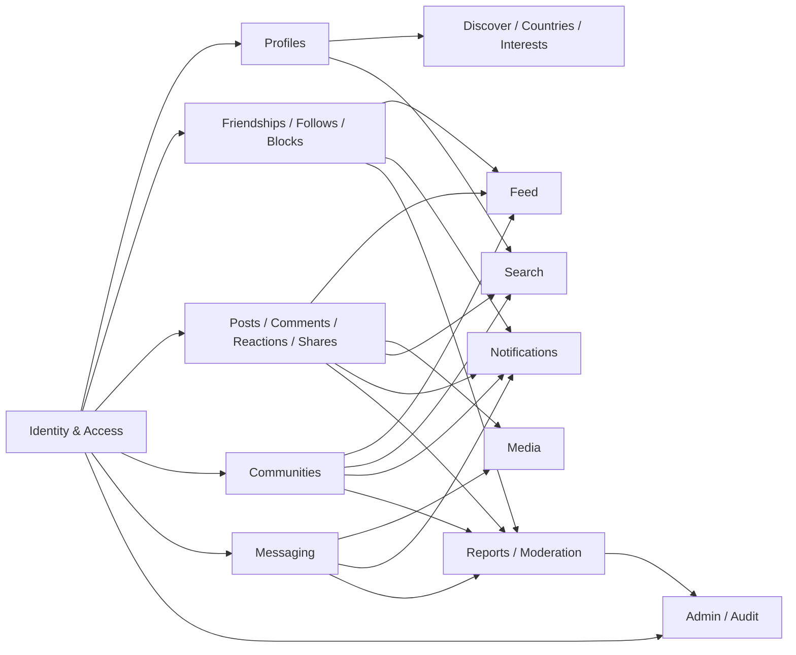
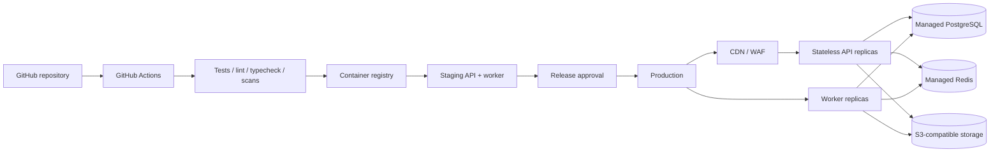

# AfriLink Architecture Specification

**Status:** Architecture specification for review and approval  
**Date:** 2026-09-13  
**Scope:** AfriLink MVP; no application source code, migrations, or API implementation

This document defines the technical architecture for the approved MVP in `docs/01-product/PRD.md`. It follows `CLAUDE.md` and preserves the approved stack and modular-monolith constraint. It defines boundaries and responsibilities; it does not implement them.

## 1. Executive architecture overview

AfriLink uses one modular-monolith backend codebase with separate API and worker runtimes. Web and mobile clients consume the same versioned REST/OpenAPI contract. WebSockets provide selected realtime delivery, but PostgreSQL remains authoritative for durable state.

**Launch scope (ADR-002, `docs/03-architecture/approval-gate.md`):** Primary launch country is Nigeria with an 18+ audience and English as the primary interface language. Country, language, and age scope are product/content parameters, not architectural constraints — reference data (countries, languages, interests) and localization are designed to extend to additional African countries, languages, and age-appropriate policy changes without structural redesign. No minor/teen account system is built for MVP.

The system consists of:

- Next.js + TypeScript web client.
- React Native + TypeScript mobile client.
- NestJS + TypeScript API and worker runtimes.
- PostgreSQL as the durable relational source of truth.
- Redis for cache, queues, rate limits, and ephemeral state.
- S3-compatible private object storage for media.
- JWT access tokens and rotating refresh tokens.
- Docker and GitHub Actions for delivery.
- Sentry and OpenTelemetry for errors, traces, metrics, and operational visibility.

The MVP does not introduce microservices, a graph database, a second system of record, or a dedicated search platform. Any exception requires an Architecture Decision Record with evidence, migration impact, ownership, and rollback planning.

## 2. Architecture principles

1. **Product alignment:** Support African discovery, country-based discovery, communities, cross-border connection, creators, businesses, and cultural context without adding unapproved scope.
2. **Modular monolith first:** Keep one deployable backend until measured scaling, reliability, ownership, or release boundaries justify extraction.
3. **Clear ownership:** Each module owns its business rules and persistence boundary.
4. **PostgreSQL authority:** Durable user, relationship, content, messaging, moderation, and audit state lives in PostgreSQL.
5. **Derived state is rebuildable:** Caches, feeds, counters, notifications, search projections, and queues can be regenerated.
6. **Secure by default:** Authentication, authorization, privacy, moderation, validation, and auditability are part of every journey.
7. **API contract first:** Web and mobile use versioned REST/OpenAPI contracts with explicit DTOs and stable error semantics.
8. **Async where appropriate:** Media, notifications, projections, and non-critical work use idempotent jobs.
9. **Low-bandwidth aware:** Clients use bounded payloads, cursor pagination, compressed media, retries, and degraded states.
10. **Measured evolution:** Performance and scaling changes follow observed demand, not speculation.

## 3. System architecture diagram



### Runtime boundaries

- **Edge:** TLS, CDN, WAF, request-size limits, bot controls, and coarse rate controls.
- **API:** REST controllers, authentication, authorization, synchronous commands/queries, and WebSocket connections.
- **Worker:** Outbox publication, notifications, media processing, feed/search projections, moderation assistance, cleanup, and retries.
- **Persistence:** PostgreSQL transactions, Redis derived state, and object-storage media.
- **Providers:** Internal adapters normalize external verification, notification, media, and safety services.

## 4. Frontend architecture

The Next.js application is organized by capability: identity, profiles, relationships, feed, posts, comments, reactions, shares, Discover, country discovery, communities, messaging, notifications, search, settings/privacy, moderation, and admin.

- Use a centralized typed API client for authentication refresh, request correlation, errors, pagination, feature flags, and telemetry.
- Keep server state in a query/cache layer and local interaction state within features/components.
- Use server rendering or static generation for permitted public profiles, communities, posts, and discovery pages.
- Use authenticated client fetching for private feeds, messages, notifications, settings, moderation, and admin.
- Frontend guards improve experience only; server authorization is mandatory.
- Implement loading, empty, error, retry, restricted, deleted, offline, and degraded states.
- Build accessibility into every feature: semantic controls, keyboard operation, focus management, contrast, labels, and assistive-technology support.

## 5. Mobile architecture

The React Native application uses feature modules matching the web product areas and shares generated API/domain types where practical.

- Store refresh credentials only in OS-protected secure storage.
- Maintain a bounded offline outbox for retryable reactions, relationship actions, posts where approved, and messages.
- Use idempotency keys or client command IDs for retryable writes and show pending, retry, conflict, and failure states.
- Use cursor synchronization for feeds, messages, notifications, search, and community lists.
- Compress and resumably upload media; defer nonessential media on metered connections.
- Support deep links for profiles, posts, communities, and conversations.
- Hide APNs/FCM behind a notification adapter.
- Reconcile optimistic state with the server after reconnect; the server is authoritative.

## 6. Backend architecture

The NestJS backend is a modular monolith with independently deployable API and worker processes built from the same codebase.

Each module uses four layers:

1. **Presentation:** REST controllers, WebSocket handlers, DTO validation, serializers, and OpenAPI metadata.
2. **Application:** Use cases, transaction boundaries, authorization, idempotency, and orchestration.
3. **Domain:** Invariants, policies, entities/value objects, and versioned domain events.
4. **Infrastructure:** Prisma repositories, PostgreSQL, Redis, queues, object storage, external adapters, and telemetry.

Controllers do not contain business rules or direct database queries. Modules communicate through application interfaces and typed events, never arbitrary reads of another module's tables. External calls do not hold database locks.

## 7. Modular monolith module structure



| Module | Owns | Key events/contracts |
|---|---|---|
| Identity & Access | Users, credentials, verification, sessions, account state, platform roles | `UserRegistered`, `UserVerified`, `AccountStateChanged` |
| Profiles | Public identity, profile data, privacy preferences | `ProfileUpdated` |
| Friendships | Friend requests and mutual relationship state | `FriendshipChanged` |
| Follows | Directed follows and visibility | `FollowChanged` |
| Blocking | User blocks and suppression policy | `BlockChanged` |
| Countries & Interests | Reference data and user selections | Discovery eligibility changes |
| Content | Posts, comments, reactions, shares, visibility | `PostPublished`, `ContentChanged` |
| Feed | Derived feed entries, hide state, ranking metadata | Consumes social/content/community events |
| Discover | Explainable discovery candidates and surfaces | Consumes eligible public projections |
| Media | Upload reservations, assets, variants, processing state | `MediaReady`, `MediaRejected` |
| Communities | Communities, memberships, rules, scoped roles | `MembershipChanged`, `CommunityChanged` |
| Messaging | Conversations, participants, messages, read state | `MessageAccepted`, `ConversationChanged` |
| Notifications | In-app records, preferences, delivery records | Consumes domain events |
| Search | Search projections and indexing state | Consumes eligible public changes |
| Moderation | Reports, cases, decisions, sanctions, appeals | `ContentActioned` |
| Admin & Audit | Admin workflows, feature flags, audit records | Security and moderation audit events |
| Privacy | Visibility, consent, retention, deletion, export policy interfaces (ADR-001) | Enforced by owning use cases |

Every cross-module event is versioned, typed, idempotently consumed, and tested.

## 8. Database architecture overview

PostgreSQL is the only durable relational source of truth for the MVP. Use one database initially with ownership-separated schemas or equivalent naming:

`identity`, `profile`, `social`, `content`, `feed`, `community`, `messaging`, `notification`, `media`, `moderation`, `admin`, `audit`, `search`, and `integration`.

- Use foreign keys, unique constraints, validation constraints, indexes, migrations, and audit fields.
- Use non-sequential public identifiers.
- Commit authoritative mutations and outbox records atomically.
- Keep feeds, counters, notifications, projections, and caches rebuildable.
- Store timestamps consistently and preserve country, language, locale, and timezone preferences.
- Apply explicit lifecycle, deletion, evidence, retention, and legal-hold policy per ADR-001 (`docs/10-decisions/decisions.md`): deleted-account personal data scheduled for deletion/irreversible anonymization within 30 days (subject to legal/security/fraud/regulatory holds); deleted content retained up to 90 days for moderation, abuse investigation, and recovery before deletion/anonymization; moderation/audit/security records retained as necessary for safety, appeals, and legal obligations; deletion procedures account for backup copies and backup expiration.
- Use Prisma as the ORM/migration direction recorded in the existing architecture decisions, but do not create migrations in this task.

## 9. REST API architecture overview

The public contract is versioned REST/JSON under `/api/v1` and described by reviewed OpenAPI schemas.

- REST is authoritative for commands and ordinary queries.
- Controllers call application services and return explicit DTOs.
- Validate bodies, path/query parameters, content types, and upload instructions at the boundary.
- Use stable machine-readable error codes and generic disclosure-safe errors.
- Use opaque cursor pagination with bounded limits for large collections.
- Require `Idempotency-Key` or equivalent client command IDs for retryable writes.
- Apply authentication, authorization, privacy, block, moderation, validation, error, pagination, and rate-limit policy per endpoint.
- Prefer additive changes; breaking changes require a new version or approved compatibility plan.

Resource areas include `/auth`, `/users`, `/profiles`, `/friends`, `/follows`, `/blocks`, `/posts`, `/comments`, `/reactions`, `/shares`, `/feed`, `/discover`, `/countries`, `/communities`, `/conversations`, `/messages`, `/notifications`, `/media`, `/search`, `/reports`, `/moderation`, and `/admin`.

## 10. Authentication architecture

- Registration identifiers are email or phone number plus password (ADR-001, `docs/10-decisions/decisions.md`); no government-ID/KYC verification in MVP.
- Account activation requires verification (email or phone challenge) before full access.
- Users identify themselves by username/display name/profile name; no universal real-name enforcement.
- Use short-lived JWT access tokens and rotating refresh tokens.
- Store refresh-token representations as hashes and support device/session revocation.
- Hash passwords with a memory-hard algorithm such as Argon2id; never log credentials or tokens.
- Make verification and recovery challenges single-use, expiry-bound, and rate-limited.
- Use secure HttpOnly/SameSite cookies where web policy selects cookies and OS-protected storage for mobile refresh credentials.
- Require MFA and recent re-authentication for sensitive administrator actions.
- Audit login, verification, recovery, credential changes, session revocation, role changes, and administrative actions.
- Identity/account-type verification badges (Person, Creator, Business, Organization) are a future enhancement, not MVP scope.
- Registration enforces an 18+ minimum age declaration (ADR-002); MVP does not build a minor/teen account model, parental controls, or age-tiered experience. Age-assurance strength beyond self-declaration is a future/legal consideration.

## 11. Authorization/RBAC

Authorization is enforced in application use cases and combines authentication/account state, resource ownership, relationship, visibility, block state, moderation sanctions, community role scope, and field-level disclosure.

Platform roles are separate from community roles. Platform RBAC is least privilege and may include support, moderator, senior moderator, operations, and security administrator roles. Community roles are scoped to one community and cannot grant platform authority. Admin actions require MFA, recent re-authentication for sensitive operations, and audit records. The exact role matrix remains an open product/operations decision.

## 12. Social graph architecture

Friendships, follows, and blocks are separate relationship types (ADR-002).

**Friendships:**

- Mutual relationship requiring a request and an acceptance; declined/removed requests return to no relationship.
- Friend relationship existence is private by default (visible only to the two participants and, where permitted, mutuals).
- Users control whether their friend list is visible to others, subject to the same default-private posture.

**Follows:**

- One-way, directed relationship; no acceptance step required.
- Public by default (visible on profiles and to search) unless the followed account restricts followability or follower-list visibility.
- Intended to support creator/public-profile discovery distinct from the private friendship graph.

**Common rules:**

- Blocks suppress discovery, feeds, messaging, notifications, and interaction according to policy.
- Relationship mutations are transactional and idempotent.
- Derived counts are repairable from authoritative relationships.
- Visibility rules for friendship existence, friend-list visibility, and follow/follower-list visibility are enforced consistently everywhere a relationship could leak: profile views, feed composition, search results, notifications, and messaging eligibility checks.
- Authorization checks relationship, visibility, account state, blocks, and moderation before reads or writes.
- Use PostgreSQL relationships and indexes; do not add a graph database for MVP.

## 13. Feed architecture

Use a deterministic, explainable hybrid feed:

1. Content commits a post and `PostPublished` in one transaction.
2. Workers create bounded feed entries for active eligible relationships and communities.
3. High-fan-out authors use pull-on-read rather than unbounded fan-out.
4. Reads merge projections and pull sources, then apply privacy, block, account, community, and moderation filters before ranking.
5. Results use cursor pagination.
6. Deletions, hides, blocks, sanctions, and privacy changes trigger invalidation or rebuild work.

Ranking signals for MVP are relationship, relevance, recency, and basic engagement (ADR-002) — a deterministic, explainable scoring function, not a complex AI/ML recommendation system. The ranking function is implemented behind a single application-service interface so a more advanced recommender can be introduced later without changing feed generation, storage, or client contracts. Exact signal weighting, freshness decay, and cold-start behavior are tunable implementation parameters, not architectural blockers.

## 14. Messaging architecture

**MVP scope (ADR-002):** one-to-one conversations only; text messages and image attachments; message requests (an initial message from a non-connection is held as a request until accepted); read status; block/report integration. Small-group conversations, voice calls, video calls, voice notes, and live streaming are explicitly out of MVP scope — the conversation/participant model below does not preclude group conversations later, but no group-specific UX or fan-out is built now.

- Conversations and membership are relational and owned by Messaging.
- Message requests are a conversation/message state (pending vs. accepted), not a separate data model, so accepting a request is a state transition rather than a migration.
- REST creates messages; WebSockets deliver accepted events to authorized connected participants.
- PostgreSQL is authoritative; clients recover missed messages through cursors after reconnect.
- Message sends use client idempotency keys.
- Delivery/read state is separate from message acceptance.
- Presence and typing are short-lived Redis signals, never durable facts.
- Attachments reference approved Media assets (image attachments only for MVP).
- Conversation creation, participants, sends, and delivery enforce relationship, privacy, block, membership, sanction, reporting, and retention rules.

## 15. Notification architecture

Notifications are created asynchronously from domain events.

- In-app notifications are durable PostgreSQL records.
- Push, email, and SMS are provider adapters with retry, backoff, delivery state, and reconciliation.
- Preferences control category, channel, consent, locale, and quiet hours where supported.
- Repeated activity is grouped or collapsed according to product policy.
- Notification creation re-checks recipient visibility, block state, and account state.
- Push payloads contain no sensitive message content by default.

## 16. Media/file architecture

**MVP scope (ADR-002):** profile images, post images, and limited video uploads, with basic image/video validation and processing. Voice notes, live streaming, advanced short-video/reels infrastructure, and advanced video editing are explicitly out of MVP scope — the pipeline below is intentionally generic so those formats can be added later as new asset purposes/variants rather than a new pipeline.

1. The API authorizes owner, purpose, type, size, and quota and creates a pending asset.
2. The client uploads directly to private S3-compatible storage using short-lived signed instructions.
3. Completion queues validation and processing.
4. Workers verify type, size, checksum, dimensions, and duration; scan where available; strip unsafe metadata; and create variants.
5. Only ready and policy-approved variants become referenceable or deliverable.
6. Deletion and orphan cleanup follow reference and retention policy.

Never trust filenames or client MIME declarations. Exact numeric limits (file size, video duration/bitrate ceilings), safety-scanning provider, and processing-time targets are implementation/infrastructure parameters deferred alongside vendor selection (§13/ADR-002) — they do not change this pipeline's shape.

## 17. Community architecture

Communities own profile, visibility, rules, membership, invitations, and scoped roles.

- Public communities are discoverable; private communities require approved join or invitation flows.
- Membership transitions are stateful, authorized, and audited.
- Owners and moderators act only within community scope.
- Community content reuses Content and Feed contracts with membership checks.
- Serious cases escalate to platform Moderation.
- Private communities, pending memberships, and restricted activity do not leak through search, feed, notifications, or errors.

## 18. Search architecture

The MVP begins with PostgreSQL full-text search and search-owned projections. Search indexes only eligible profiles, communities, and public content.

- Projections update asynchronously from approved source changes.
- Results are rechecked against source visibility, account state, blocks, moderation, deletion, and privacy before return.
- Search supports bounded queries, safe limits, abuse controls, and useful no-result states.
- Country, language, and community context may be indexed where approved.
- A dedicated search platform is a future option only after measured relevance, language, or latency limits justify it.

## 19. Country-discovery architecture

Countries and Interests own supported reference data and user selections. Discover consumes those signals to build explainable public discovery surfaces.

- Profiles may expose country/region context according to privacy settings.
- Users can explore eligible people, communities, and content associated with another country or region.
- Country discovery supports cross-border exploration and does not imply identity or country verification unless explicitly approved.
- Results respect language, privacy, blocks, account state, and moderation.
- Country and region data is reference-controlled rather than free-form authorization data.
- Country reference data launches with Nigeria as the primary market but is not hard-coded to it — additional countries are added as reference rows, not schema or code changes (ADR-002).

**Discover ranking (ADR-002):** MVP Discover prioritizes country, interests, social relationships, activity, recency, and community relevance through the same deterministic, explainable scoring approach as the feed — no machine-learning ranking for MVP. Region granularity below country level and exact signal weighting remain tunable implementation parameters.

## 20. Moderation architecture

Moderation is a first-class workflow for profiles, posts, comments, shares, messages, and communities. MVP uses **post-moderation** (ADR-001): content publishes after basic automated checks, with enforcement handled through reporting, queues, and human review rather than pre-publish blocking.

- Reports create categorized cases with deduplication, priority, assignment, status, evidence access, and response tracking.
- Automated filtering assists triage but does not silently make consequential decisions.
- Moderators may remove content, restrict content, warn users, suspend accounts, ban accounts, and restrict community participation. Actions are scoped, policy-driven, time-bounded where appropriate, and auditable.
- Users may report content, users, and communities; block users; and appeal eligible moderation decisions.
- Initial report taxonomy (ADR-002): Spam, Harassment, Hate, Impersonation, Scam/fraud, Violence, Sexual content, Misinformation, Other.
- Appeal target: 72 hours for normal appeals, with critical safety/security cases prioritized faster (ADR-002). This is an operational target for queue design and alerting, not a guaranteed legal SLA — the case model tracks category, priority, and age so the target is measurable and enforceable operationally.
- Evidence is minimized, access-controlled, and retained separately from ordinary user-visible deletion, consistent with the moderation/audit retention rule in ADR-001.
- Blocks, sanctions, and actions apply consistently to discovery, feed, messaging, notifications, and communities.
- Advanced/AI-assisted moderation beyond basic automated filtering is a future enhancement, not MVP scope.

Sanction durations (exact suspension/ban length tiers), the community role/permission matrix beyond owner and moderator, and the legal escalation path are policy/operational parameters layered on top of this model — they do not require architectural changes and are deferred to moderation-policy and legal review rather than architecture approval.

## 21. Admin architecture

The admin dashboard is a protected web feature area using the same API with stronger authorization and mandatory audit logging. It provides authorized operators with report/case queues, controlled user/profile/content/community/account lookup, sanctions, appeals, provider and queue health, approved operational settings, feature flags, and role-appropriate audit search.

It exposes no secrets, raw credentials, arbitrary SQL, or unscoped production edits. Exact roles, support workflows, and operational metrics remain open decisions.

## 22. Redis/cache strategy

Redis is never authoritative.

- Cache public profile/community summaries, approved discovery read models, feature flags, permission snapshots, and safe derived reads with bounded TTLs.
- Use namespaced keys, size limits, jittered expiry, and explicit invalidation for critical mutations.
- Cache feed pages only when privacy and invalidation are safe; prefer per-user feed projections.
- Use counters for rate limits and short-lived keys for presence/typing.
- Use request coalescing or narrow locks to reduce stampedes.
- Never cache private responses across users or before authorization.
- Every cache/projection has a rebuild or source-of-truth recovery path.

## 23. Background jobs

The transactional outbox publishes at-least-once events to Redis/BullMQ queues:

- `feed`: fan-out, ranking refresh, rebuilds, counter repair.
- `notifications`: in-app creation and provider delivery.
- `media`: validation, scanning, processing, variants, cleanup.
- `moderation`: triage signals, prioritization, retention, safety assistance.
- `search`: projection updates and reindexing.
- `maintenance`: session expiry, deletion, orphan cleanup, repairs.

Every job has a version, idempotency key, retry/backoff, timeout, dead-letter behavior, structured metrics, and a runbook. Queue lag, retries, and failures are observable before concurrency changes.

## 24. WebSocket architecture

WebSockets are a delivery channel, not a second write API.

- Authenticate during connection establishment and authorize every channel/subscription.
- Deliver only events the connection is currently permitted to see.
- Initial durable events may include accepted/updated/deleted messages, read-state changes, and notification creation.
- Presence and typing may be ephemeral best-effort events backed by Redis TTLs.
- Events include event ID, type, resource ID, version, and server timestamp.
- Clients reconnect using durable cursors and recover through REST.
- Connection limits, heartbeat, backpressure, reconnect, and abuse controls are required.

## 25. Security architecture

Defense in depth includes TLS, secure headers, strict CORS, WAF controls, CSRF protection for cookie-authenticated changes, central validation, output encoding, safe rich-text handling, SSRF protection, media scanning, resource-level authorization, IDOR/privilege tests, layered rate limits, managed secrets, isolated credentials, encryption at rest, redacted logs/traces, dependency/container/secret/migration scanning, and incident response.

Incident response covers credential revocation, evidence preservation, moderation escalation, and user communication. Secrets, tokens, passwords, private user information, and unnecessary PII must not appear in source control, logs, notifications, analytics, errors, or public URLs.

Per ADR-001, the platform is privacy-by-design: collect only data necessary for defined features, never sell personal data, protect private messages/contact information/precise location as protected data, and provide user-facing data-export and account/data-deletion mechanisms enforced through the same API authorization layer as other resource access. Production data residency is not restricted to a single country; cloud region selection weighs latency, reliability, security, data-protection requirements, cost, and cross-border transfer requirements, and any cross-border transfer must be reviewed against applicable law before production use. Compliance design targets the Nigeria Data Protection Act 2023 and applicable NDPC requirements; GDPR applicability is assessed separately per actual processing activity rather than claimed by default.

## 26. Observability and monitoring

Use Sentry for application errors and OpenTelemetry for traces and metrics.

- Structured logs contain request/trace IDs, actor classification, route template, status, latency, error code, and dependency timing without sensitive payloads.
- Trace API, database, Redis, queues, storage, and external providers.
- Monitor latency/error rates, database pool/locks, cache hit rate, queue lag, job failures, feed freshness, upload failures, authentication abuse, message delivery, notification delivery, moderation response, and provider health.
- Alert on availability, saturation, data freshness, security anomalies, failed jobs, and recovery health.
- **MVP SLOs (ADR-002):** 99.5% availability for core production services; p95 API latency below 500ms for normal requests under expected MVP load. These are initial planning targets to design and alert against, not confirmed guarantees — they must be validated by load testing before being treated as commitments.
- RPO/RTO numeric targets remain deferred to the deployment/infrastructure phase alongside vendor selection (§13/ADR-002).

## 27. Deployment architecture



- Build and scan Docker images in GitHub Actions.
- Require tests, type checks, lint, contract checks, security scans, and migration compatibility checks.
- Scale API and worker runtimes independently from the same codebase.
- Use health/readiness probes, graceful shutdown, rolling or blue/green releases, and rollback/forward-fix procedures.
- Use encrypted backups, point-in-time recovery, restore drills, and private database/network placement.
- Never couple destructive schema changes to the first application release that requires them.

**Vendor neutrality (ADR-002):** the architecture stays vendor-neutral where practical — managed PostgreSQL, managed Redis, and S3-compatible object storage are specified by capability, not by a named provider, and the application must not be hard-coded to a specific cloud. Specific infrastructure vendors (cloud provider, database hosting, object storage, CDN, messaging/queue infrastructure) are selected during the deployment/infrastructure phase, evaluated on cost, African-region availability, reliability, security, data protection, and each service's availability in-region. This selection is deferred deliberately and does not block architecture approval.

## 28. Repository/folder architecture

```text
apps/
  web/                  # Next.js web client and admin area
  mobile/               # React Native client
services/
  api/                  # NestJS modular monolith API and worker entrypoints
packages/
  types/                # Shared generated/API/domain types
  ui/                   # Shared UI primitives where practical
  config/               # Shared configuration and tooling
database/
  migrations/           # Versioned migrations after architecture approval
  seeds/                # Non-PII development/test seeds
tests/
  unit/
  integration/
  api/
  e2e/
infrastructure/        # Docker, CI, deployment, and environment definitions
docs/
  01-product/
  03-architecture/
  04-database/
  05-api/
```

Within `services/api`, each module owns `presentation`, `application`, `domain`, and `infrastructure` areas. Shared packages cannot bypass module ownership. Exact file scaffolding is implementation work and is not created here.

## 29. Development environments

- **Local:** Docker Compose for PostgreSQL, Redis, and safe provider substitutes; no production secrets.
- **CI:** Isolated test database and disposable dependencies; run unit, integration, API, security, migration, and contract checks.
- **Staging:** Production-like configuration, non-PII seed data, provider sandboxes, realistic media limits, and observability.
- **Production:** Private network placement, managed PostgreSQL/Redis/storage, CDN/WAF, encrypted backups, point-in-time recovery, and separate API/worker scaling.

Environment configuration is injected through managed secrets or secure CI variables. `.env` files, credentials, tokens, and private certificates are never committed.

## 30. Dependency map

| Dependency | Consumers | Failure behavior |
|---|---|---|
| PostgreSQL | All durable modules | Durable writes fail closed; only explicitly safe reads may use cache |
| Redis | Cache, queues, rate limits, presence | Durable state remains safe; degraded behavior follows fallback policy |
| Object storage/CDN | Media/content | Existing media remains referenced; new uploads pause or retry |
| Email/SMS provider | Verification and recovery | Queue/retry; unrelated authenticated activity continues |
| Push provider | Notifications/mobile | In-app notifications remain; delivery failure is recorded |
| Media/safety providers | Media and moderation | Asset remains pending or goes to human review; never silently approved |
| Sentry/OpenTelemetry | All runtimes | Traffic continues; observability degradation alerts |
| GitHub Actions/registry | Delivery | Existing release remains; unverified releases are blocked |

## 31. Technical risks

| Risk | Impact | Mitigation |
|---|---|---|
| Undefined detailed policy (community role matrix, sanction durations, legal escalation path) and numeric success/activation thresholds | Rework in authorization, schemas, operations if resolved late | Launch market, core policy, and reliability/performance targets are resolved (ADR-001, ADR-002); resolve remaining policy/threshold detail before implementation freeze |
| Feed fan-out hotspots | Queue pressure and stale feeds | Bounded hybrid push/pull, deterministic ranking, backpressure |
| Messaging abuse and growth | User harm, privacy risk, storage cost | Relationship gates, blocks, reports, limits, retention, cursors |
| Media cost or unsafe files | High cost or compromise | Private direct upload, validation, scanning, variants, quotas |
| Cross-module coupling | Slow delivery and inconsistent policy | Contract ownership and dependency tests |
| Provider outage | Verification, delivery, or processing failure | Adapters, retries, fallback states, health monitoring |
| Admin privilege misuse | Severe privacy/safety impact | MFA, least privilege, re-authentication, immutable audit |
| Database growth | Performance and recovery degradation | Query budgets, indexes, backups, restore drills, measured partitioning |

## 32. Scalability considerations

**Initial capacity target (ADR-002):** design the MVP to support approximately 10,000 registered users and 1,000 concurrent users without a fundamental architectural rewrite. This is a planning target for sizing connection pools, queue concurrency, and instance counts — not a statement that the target is met until load-tested.

Scale according to measured demand:

1. Establish query budgets, indexes, cursor pagination, pool limits, and slow-query monitoring.
2. Scale stateless API and worker replicas independently.
3. Add safe caches and read replicas after consistency requirements are understood.
4. Separate high-volume queues and apply backpressure.
5. Partition proven hot tables such as messages, audit events, notifications, or feed entries after migration rehearsal.
6. Replace PostgreSQL search only when language, relevance, or latency evidence justifies it.
7. Extract a module only when distinct scaling, reliability, ownership, or deployment needs cannot be met within the monolith.

Potential future extraction candidates are media processing or messaging delivery, not identity or authorization. Extraction requires an ADR, contract tests, event ownership, data migration, operational ownership, and rollback planning.

## 33. Future expansion considerations

Future expansion is not MVP implementation. After measured MVP validation and explicit approval, the architecture may accommodate deeper creator/business experiences, advanced discovery, additional content formats, monetization, commerce, jobs, financial services, live experiences, or broader integrations.

Any future capability requires product approval and architecture review. It must not compromise MVP privacy, moderation, authorization, or source-of-truth boundaries. Marketplace, payments, jobs, advanced creator monetization, and live streaming remain outside MVP.

## 34. Definition of Done

This architecture specification is complete for review when:

- All MVP capabilities have an owning module, client surface, authorization boundary, and asynchronous behavior identified.
- The approved stack and modular-monolith constraint are preserved.
- PostgreSQL is authoritative and Redis is derived/ephemeral.
- REST/OpenAPI, JWT/refresh authentication, WebSockets, media storage, jobs, and client recovery are defined.
- Friendships, follows, blocks, Discover, country discovery, communities, privacy, moderation, admin, media, and analytics have explicit boundaries.
- Security, RBAC, audit, deletion, retention, accessibility, low-bandwidth, and observability concerns are represented.
- Dependency failure behavior, deployment environments, backups, restore expectations, and scaling paths are documented.
- No migrations, API implementation, or application source code is included.
- Product requirements are not removed or silently redefined.
- Architecture owners approve this document before database and API implementation proceeds.

## Assumptions

- The technology stack in `CLAUDE.md` is approved and unchanged.
- The MVP scope in the PRD is approved. Launch market/language/age, core privacy/moderation/retention/identity/residency policy, and numeric reliability/performance/capacity targets are resolved (ADR-001, ADR-002). Detailed behavior decisions (e.g., community role matrix, sanction durations, legal escalation path, numeric activation/retention success thresholds) remain open but do not block this architecture.
- Web and mobile clients use one versioned backend contract.
- PostgreSQL full-text search is sufficient initially unless target-language testing disproves it.
- User-generated content, messaging, communities, and media require safety controls from first public release.
- Initial deployment is centralized or regional; multi-region operation and residency model are not selected.

## Decisions

- Use a NestJS modular monolith with separate API and worker runtimes.
- Use PostgreSQL as the sole MVP durable source of truth.
- Use Redis only for derived/ephemeral state, queues, rate limits, cache, and presence/typing.
- Use versioned REST/OpenAPI for durable commands and queries, with WebSockets limited to delivery.
- Use a transactional outbox and idempotent background jobs.
- Use direct private object-storage uploads with validated, processed, approved variants.
- Use PostgreSQL relationships for the social graph and PostgreSQL full-text search initially.
- Use deterministic, explainable hybrid feed generation instead of opaque personalization.
- Keep community roles scoped and separate from platform RBAC.
- Adopt ADR-001 (`docs/10-decisions/decisions.md`): privacy-by-design with user export/deletion rights, post-moderation model, 30/90-day account/content deletion retention windows, email/phone/password identity with no KYC, and region selection without a Nigeria-only residency mandate.
- Adopt ADR-002 (`docs/03-architecture/approval-gate.md`): Nigeria-primary/English-primary/18+ launch scope with multi-country/localization-ready architecture; mutual/private-by-default friendships vs. one-way/public-by-default follows; deterministic (non-ML) feed and Discover ranking behind a pluggable ranking interface; one-to-one text+image messaging with message requests; profile/post images plus limited video for MVP media; expanded moderation report taxonomy and a 72-hour appeal operational target; 99.5% availability and p95<500ms SLO targets; ~10k-user/1k-concurrent capacity target; vendor-neutral infrastructure with vendor selection deferred to the deployment phase.

## Dependencies

- Remaining policy-level detail: community role/permission matrix beyond owner/moderator, sanction duration tiers, legal escalation path, and the push/email/SMS launch-channel decision. None of these require architecture changes. (Launch country/language/age, friend/follow semantics, feed/Discover ranking model, messaging/media scope, report taxonomy, appeal SLA target, and SLO/capacity targets are resolved by ADR-002; identity, privacy/retention/residency, and moderation model are resolved by ADR-001.)
- Approved cloud region and providers for verification, notifications, media, safety, storage, CDN, backups, and monitoring — deliberately deferred to the deployment/infrastructure phase per ADR-002 vendor-neutrality decision, not a blocker to architecture approval.
- Moderation and support operations with defined authority and service levels.
- GitHub Actions, container registry, infrastructure-as-code, backup, restore, incident response, and security testing.

## Risks

Primary risks are undefined detailed policy/threshold decisions (community role matrix, sanction durations, legal escalation path, numeric success thresholds — launch market, core policy, and reliability/performance targets are already resolved per ADR-001/ADR-002), feed fan-out, messaging abuse, media cost and safety, cross-module coupling, provider failure, admin misuse, and database growth. Mitigations are defined in sections 31 and 32 and must be converted into implementation tests and operational runbooks after approval.

## Open questions

1. ~~Which countries, languages, regions, diaspora segments, and age groups launch first?~~ Resolved by ADR-002: Nigeria primary launch country, English primary language, 18+ only, architecture must support expansion. Secondary-country sequencing, diaspora-targeting priority, and additional launch languages remain future product decisions but do not block architecture approval.
2. ~~Which identity and verification methods are required?~~ Resolved by ADR-001: email/phone + password, verification-gated activation, no KYC.
3. ~~How exactly do friends differ from follows for visibility, messaging, and notifications?~~ Resolved by ADR-002: mutual, request/accept, default-private friendships vs. one-way, default-public follows; see §12.
4. ~~What are feed and Discover cold-start, ranking, and freshness rules?~~ Resolved at a model level by ADR-002 (deterministic relationship/relevance/recency/engagement signals; no ML). Exact weighting, decay curves, and cold-start heuristics are tunable implementation parameters, not architecture blockers.
5. ~~Are small-group messaging, media attachments, push, email, and SMS in the first release?~~ Messaging/media scope resolved by ADR-002: one-to-one only, text + image attachments, message requests, read status; profile/post images and limited video. Whether push/email/SMS notification channels ship at MVP launch (vs. in-app only) remains an open, low-risk product/vendor decision — the notification architecture already treats each channel as an optional adapter, so this does not block architecture approval.
6. What are the exact community role matrix (beyond owner/moderator), sanction durations, and legal escalation rules? (Report taxonomy and appeal SLA target resolved by ADR-002; see §20.) These are policy parameters layered on the existing moderation model, not structural changes.
7. ~~What are the privacy, consent, deletion, export, retention, residency, and cross-border transfer requirements?~~ Resolved by ADR-001 (see `docs/10-decisions/decisions.md`), unchanged by ADR-002.
8. ~~What cloud region, vendors, traffic assumptions, SLOs, RPO, and RTO apply?~~ SLOs resolved by ADR-002 (99.5% availability, p95 < 500ms, ~10k users/1k concurrent capacity target). Vendor/region selection and numeric RPO/RTO are deliberately deferred to the deployment/infrastructure phase (§13/ADR-002), not withheld for lack of a decision.

## Approval gate

This specification intentionally stops before database implementation. The next step is architecture review and approval. Database schema, migrations, OpenAPI details, and API implementation must not begin until this architecture and the blocking product decisions above are approved.

**Update (2026-09-14):** ADR-001 (`docs/10-decisions/decisions.md`) resolves the privacy, moderation model, data retention, identity/verification, and data-residency decisions referenced throughout this document.

**Update (2026-09-14, ADR-002):** `docs/03-architecture/approval-gate.md` resolves launch country/language/age scope, friend/follow semantics, feed and Discover ranking model, messaging and media MVP scope, moderation report taxonomy and appeal SLA target, reliability/performance/capacity targets, and the vendor-neutrality decision. The only remaining items — community role matrix detail, sanction duration tiers, legal escalation path, the push/email/SMS launch-channel choice, and specific vendor/region selection — are policy or infrastructure-selection parameters that fit within the architecture as already defined and do not require further architecture changes to proceed.

**ARCHITECTURE STATUS: READY FOR OWNER APPROVAL**
