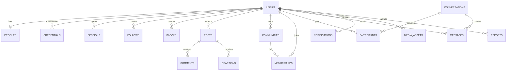

# AfriLink PostgreSQL Database Design

**Status:** Draft — derived from the current architecture draft
**Date:** 2026-09-13
**Database:** PostgreSQL
**ORM/migrations assumption:** Prisma with versioned migrations

> PostgreSQL, Prisma, Redis, and the modular-monolith constraint are defined in `CLAUDE.md`. `docs/01-product/PRD.md` remains empty, so product scope and retention policy still require approval. No application code or executable migration is included.

## 1. Database goals

The database must provide:

- strong transactional integrity for identity, permissions, relationships, content, memberships, and messages;
- clear ownership boundaries between modular-monolith modules;
- efficient cursor-based reads for feeds, conversations, notifications, and moderation queues;
- durable event publication through a transactional outbox;
- privacy-aware lifecycle management, deletion, retention, and auditability;
- a straightforward path to replicas, partitioning, and selective read models as usage grows.

PostgreSQL is the source of truth. Redis, object storage, search projections, and feed caches are derived or ephemeral and must be rebuildable.

## 2. Logical database layout

Use one PostgreSQL database initially. Organize tables into PostgreSQL schemas by module ownership:

| Schema | Responsibility |
|---|---|
| `identity` | Users, credentials, sessions, verification, roles, account state |
| `social` | Profiles, follows, blocks, user preferences |
| `content` | Posts, comments, reactions, visibility, content references |
| `feed` | Materialized feed entries and ranking metadata |
| `community` | Communities, memberships, roles, invitations |
| `messaging` | Conversations, participants, messages, receipts |
| `notification` | Notification records, preferences, delivery attempts |
| `media` | Upload reservations, assets, variants, processing state |
| `moderation` | Reports, cases, evidence references, decisions, appeals, sanctions |
| `admin` | Platform configuration, feature flags, administrative actions |
| `audit` | Append-only security and compliance audit events |
| `search` | Search projection metadata and indexing state |
| `integration` | Idempotency records and transactional outbox |

The application layer must respect schema ownership. A module may query another module through a repository/application contract, not by reaching into another module's tables from arbitrary code.

## 3. Common data conventions

### Identifiers

- Use UUIDv7, ULID, or an equivalent time-sortable identifier for public and primary keys. Select one format before implementation and use it consistently.
- Public IDs must not expose sequential database identity.
- Foreign keys use the same identifier type as their referenced primary key.
- External provider IDs are stored separately from internal IDs and scoped by provider.

### Timestamps

- Use `timestamptz` for `created_at`, `updated_at`, and lifecycle timestamps.
- Store timestamps in UTC; render them in the user's locale/time zone at the application boundary.
- Use database defaults for creation timestamps and application-controlled updates for modification timestamps.

### Lifecycle fields

Durable user-generated and administrative records should use the applicable subset of:

- `created_at`;
- `updated_at`;
- `deleted_at` for user-visible soft deletion;
- `deleted_by` or `deletion_reason` where auditability is required;
- `status` for explicit workflow state.

Do not use soft deletion as a replacement for retention policy. Personal data deletion, legal holds, moderation evidence, and audit retention require separate policy decisions.

### Text, JSON, and enums

- Use `text` for human text with application length limits.
- Use `citext` or normalized text for case-insensitive usernames, handles, and email lookup where appropriate.
- Use `jsonb` only for provider payloads, flexible metadata, and versioned settings—not for core relationships.
- Prefer database constraints for small, stable state sets. Use lookup tables or validated text for policies likely to change frequently.
- Normalize user-provided Unicode before uniqueness/search operations while preserving the original display form.

### Privacy and sensitive values

- Store password and token material only as one-way hashes where possible.
- Encrypt high-risk fields at the application or managed database layer; keep encryption keys outside PostgreSQL.
- Do not store media bytes, access tokens, secrets, or raw provider credentials in the database.
- Treat message bodies, reports, evidence references, contact information, and authentication metadata as sensitive.

## 4. Identity schema

### `identity.users`

The canonical account record.

| Column | Type/meaning | Rules |
|---|---|---|
| `id` | public identifier | Primary key |
| `handle` | normalized unique handle | Unique; nullable until onboarding if allowed |
| `status` | active, restricted, suspended, banned, pending_deletion, deleted | Required |
| `account_type` | individual, creator, business, organization | Required; product policy controls available types |
| `locale` | BCP 47 locale | Default from onboarding; validated |
| `timezone` | IANA time zone | Validated |
| `created_at`, `updated_at` | timestamps | Required |
| `deleted_at` | timestamp | Nullable; handle reuse policy must be explicit |

Recommended indexes: unique normalized handle, status/created-at, and deleted-at lifecycle queries.

### `identity.credentials`

Stores authentication methods, never plaintext credentials.

- `id`, `user_id`, `kind`, `identifier_normalized`, `secret_hash`, `verified_at`, `last_used_at`, `created_at`, `revoked_at`.
- Unique `(kind, identifier_normalized)` for active credentials.
- A user may have multiple credentials; recovery and verification rules are enforced by the Identity module.
- For phone/email OTP, store only the hash of the challenge, expiry, attempt count, and consumed timestamp in a separate challenge record if required.

### `identity.sessions`

- `id`, `user_id`, `refresh_token_hash`, `device_id`, `device_label`, `ip_hash`, `user_agent_hash`, `created_at`, `last_seen_at`, `expires_at`, `revoked_at`, `revoke_reason`.
- Unique refresh-token hash; index `(user_id, revoked_at, expires_at)`.
- Never log raw tokens. Revoke all sessions after high-risk credential changes when policy requires it.

### `identity.verification_challenges`

- `id`, `user_id`, `channel`, `destination_hash`, `purpose`, `challenge_hash`, `attempt_count`, `expires_at`, `consumed_at`, `created_at`.
- Index active challenges by destination/purpose and expiry.
- Enforce one-time use and rate limits at the application and infrastructure layers.

### `identity.roles`, `identity.permissions`, `identity.role_permissions`, `identity.user_roles`

Platform roles are separate from community roles. Store scoped assignments with:

- role/permission identifiers;
- `user_id`, optional scope type and scope ID;
- grantor and timestamps;
- optional expiry.

Never model a community moderator as a global administrator. Unique constraints must prevent duplicate active assignments.

## 5. Social schema

### `social.profiles`

- `user_id` primary key and foreign key to `identity.users`;
- `display_name`, `bio`, `avatar_media_id`, `country_code`, `region`, `website_url`;
- `visibility`, `language_preferences`, `profile_metadata`;
- `created_at`, `updated_at`, `deleted_at`.

Do not use free-form profile metadata for authorization or moderation decisions. Country and language code formats must be selected and validated before implementation.

### `social.follows`

- `follower_id`, `followee_id`, `status`, `created_at`, `deleted_at`;
- primary/unique active relationship on `(follower_id, followee_id)`;
- indexes `(followee_id, created_at, follower_id)` and `(follower_id, created_at, followee_id)`;
- check preventing self-follow unless explicitly approved by product policy.

Use soft deletion or a relationship state if historical follow events are needed. Counts are derived and repairable, not authoritative.

### `social.blocks`

- `blocker_id`, `blocked_id`, `reason_code`, `created_at`, `deleted_at`;
- unique active pair `(blocker_id, blocked_id)`;
- indexes in both directions for authorization and suppression checks;
- check preventing self-block.

Blocks must be applied before profile discovery, feed assembly, notifications, and messaging visibility.

### `social.user_preferences`

Stores privacy defaults, discovery settings, locale preferences, accessibility settings, quiet hours, and notification defaults. Keep channel-specific notification preferences in `notification` if the owning module requires it.

## 6. Content schema

### `content.posts`

- `id`, `author_id`, optional `community_id`, `body`, `status`, `visibility`, `language_code`;
- `published_at`, `edited_at`, `deleted_at`, `created_at`, `updated_at`;
- optional `reply_to_post_id` only if threaded posts are approved;
- moderation state must be explicit and separate from deletion status.

Indexes:

- `(author_id, created_at desc, id desc)`;
- `(community_id, created_at desc, id desc)` for community feeds;
- `(status, published_at desc, id desc)` for moderation and projection workers;
- partial indexes excluding deleted or non-published rows where useful.

### `content.comments`

- `id`, `post_id`, `author_id`, optional `parent_comment_id`, `body`, `status`, `created_at`, `updated_at`, `deleted_at`;
- indexes `(post_id, created_at, id)` and `(parent_comment_id, created_at, id)`;
- foreign keys must prevent orphan comments unless a deliberate tombstone policy is implemented.

### `content.reactions`

- `user_id`, `post_id` or a polymorphic target design; prefer separate target tables when referential integrity is important;
- `reaction_type`, `created_at`, `deleted_at`;
- unique active `(user_id, post_id, reaction_type)` or `(user_id, post_id)` if only one reaction is allowed.

For an MVP supporting posts and comments, separate `post_reactions` and `comment_reactions` tables are preferable to an unconstrained polymorphic foreign key.

### `content.post_media` and `content.comment_media`

Join approved media assets to content with an explicit ordering, alt text, and display metadata. Media ownership remains with `media`; content rows reference media IDs and must not store provider URLs as the authority.

### `content.visibility_rules`

Use an explicit visibility model such as `public`, `followers`, `community_members`, `mentioned_users`, and `private`. If exceptions are required, store them in a constrained access table rather than embedding user IDs in JSON.

Visibility is evaluated with account state, blocks, community membership, moderation state, and deletion state.

## 7. Feed schema

### `feed.entries`

Derived per-viewer or per-source feed records:

- `id`, `viewer_id`, `post_id`, optional `community_id`;
- `source_type`, `source_id`, `ranking_version`, `score`;
- `created_at`, `eligible_at`, `expires_at`, `hidden_at`.

Indexes:

- `(viewer_id, eligible_at desc, id desc)` for cursor pagination;
- `(post_id, viewer_id)` for invalidation and deduplication;
- queue/rebuild indexes by ranking version and eligibility.

Feed entries are disposable projections. The Content, Social, Community, and Moderation modules remain authoritative. A rebuild job must be able to regenerate entries after deletion, block, privacy, or ranking changes.

## 8. Community schema

### `community.communities`

- `id`, `owner_user_id`, `slug`, `name`, `description`, `visibility`, `membership_policy`;
- `avatar_media_id`, `cover_media_id`, `rules`, `status`;
- `created_at`, `updated_at`, `deleted_at`.

Unique active slug; public discovery indexes should exclude deleted/private records as appropriate.

### `community.memberships`

- `community_id`, `user_id`, `status` (`pending`, `active`, `rejected`, `left`, `removed`, `banned`);
- `role`, `requested_at`, `approved_at`, `approved_by`, `left_at`, `removed_at`, `created_at`, `updated_at`;
- unique active `(community_id, user_id)`;
- indexes `(community_id, status, created_at, user_id)` and `(user_id, status, created_at, community_id)`.

### `community.invitations`

Store inviter, invitee or token hash, community, expiry, acceptance/revocation state, and timestamps. Tokens must be hashed and single-use.

### `community.moderator_assignments`

If community roles require more detail than membership roles, store scoped role assignments with grantor, expiry, and revocation. These records must never map directly to platform roles.

## 9. Messaging schema

### `messaging.conversations`

- `id`, `kind` (`direct`, `group`), `created_by`, `title`, `status`, `last_message_at`, `created_at`, `updated_at`, `deleted_at`;
- index `(last_message_at desc, id desc)` for user conversation lists only through participant joins.

### `messaging.participants`

- `conversation_id`, `user_id`, `role`, `joined_at`, `left_at`, `muted_until`, `last_read_message_id`, `status`;
- unique active `(conversation_id, user_id)`;
- index `(user_id, status, last_read_message_id)`.

### `messaging.messages`

- `id`, `conversation_id`, `sender_id`, client idempotency key, `body`, `status`, `moderation_state`;
- `created_at`, `edited_at`, `deleted_at`, optional `reply_to_message_id`;
- unique `(sender_id, client_message_id)` to make mobile retries safe;
- index `(conversation_id, created_at, id)` for cursor reads;
- index `(sender_id, created_at)` for abuse and audit workflows.

Messages are append-oriented. Edits and deletions must preserve the minimum audit state required by policy without retaining unnecessary content.

### `messaging.message_receipts`

- `message_id`, `user_id`, `delivered_at`, `read_at`;
- unique `(message_id, user_id)`;
- use conversation-level read cursors for scale, with per-message receipts only if required by product behavior.

## 10. Notification schema

### `notification.notifications`

- `id`, `recipient_user_id`, `actor_user_id`, `type`, `target_type`, `target_id`;
- `group_key`, `payload` or safe display metadata, `read_at`, `created_at`, `deleted_at`;
- index `(recipient_user_id, created_at desc, id desc)`;
- deduplication key for repeated domain events.

Do not store sensitive message bodies in notification payloads. Re-resolve target visibility when a notification is read.

### `notification.preferences`

Store user, category, channel, enabled state, locale, quiet-hour configuration, and timestamps. Enforce one row per `(user_id, category, channel)`.

### `notification.deliveries`

- `notification_id`, `channel`, provider, provider message ID, state, attempt count, next attempt time, delivered/failed timestamps, error category;
- unique provider delivery key where available;
- indexes for pending retry work and provider reconciliation.

## 11. Media schema

### `media.assets`

- `id`, `owner_user_id`, `storage_provider`, private object key, `kind`, `state`;
- declared and verified MIME type, byte size, checksum, width, height, duration;
- `scan_state`, `moderation_state`, `created_at`, `ready_at`, `rejected_at`, `deleted_at`.

Never trust the client-declared MIME type. The asset becomes referenceable by public content only after validation and approval.

### `media.variants`

- `id`, `asset_id`, variant name, private object key, MIME type, dimensions, byte size, checksum, state, created_at;
- unique `(asset_id, variant_name)`.

### `media.uploads`

Tracks upload reservation and resumable parts: owner, asset, provider upload ID, expiry, expected size/checksum, completed timestamp, and failure state. Cleanup jobs remove abandoned reservations.

## 12. Moderation schema

### `moderation.reports`

- `id`, reporter, target type and target ID, reason code, description, status, priority, created_at, updated_at, resolved_at;
- deduplication key for equivalent active reports where policy permits;
- indexes by status/priority/created-at and target.

Because PostgreSQL cannot enforce a foreign key to multiple target tables, target references require an application-level target resolver and periodic integrity checks. If strict referential integrity is required, use separate report tables per target type.

### `moderation.cases`

- `id`, queue, assigned moderator, status, priority, SLA timestamps, source, created_at, updated_at, closed_at;
- link reports through `moderation.case_reports`.

### `moderation.actions`

- `id`, case ID, actor ID, target type/ID, action type, reason code, duration, starts/ends, reversal information, created_at;
- append-only; corrections are compensating actions, not destructive updates.

### `moderation.appeals`

Store action, appellant, statement, state, reviewer, decision, timestamps, and appeal deadline. Enforce one active appeal per applicable action unless policy allows multiple levels.

### `moderation.sanctions`

Store subject, scope, type, reason, start/end, source action, and current state. Scope must distinguish platform, community, content, and messaging restrictions.

## 13. Admin and audit schemas

### `admin.feature_flags`

Store key, environment, state, rollout rules, owner, expiry, and timestamps. Do not use feature flags as an authorization mechanism.

### `admin.provider_configs`

Store non-secret provider identifiers and operational state only. Secrets belong in a managed secret store.

### `audit.events`

Append-only records for authentication, credential changes, role changes, moderation, data access, exports, deletion, and administrative actions.

Suggested fields:

- event ID, event type, actor ID or system actor, subject type/ID;
- request ID, trace ID, IP hash, user-agent hash, reason, timestamp;
- safe structured metadata with strict redaction rules.

Audit records require restricted access, retention rules, and tamper-evident operational controls. They must not contain passwords, tokens, message bodies, or unnecessary PII.

## 14. Search schema

### `search.documents`

Search is initially implemented with PostgreSQL full-text search and projections. Store searchable entity type, entity ID, normalized document fields or generated vector, visibility state, language, version, and indexed timestamp.

- Only public/eligible content is projected.
- Deletions, blocks, sanctions, and privacy changes enqueue projection updates.
- Search results must re-check authorization against source modules before returning.
- A future search engine may replace this projection without changing source ownership.

Use generated `tsvector` columns and GIN indexes only after testing language/configuration requirements across initial markets.

## 15. Integration schema

### `integration.outbox_events`

The transactional outbox guarantees that committed state changes can be published to workers.

- `id`, event type/version, aggregate type/ID, payload, occurred_at;
- `available_at`, `published_at`, attempt count, last error, locked-until;
- index pending events by `(published_at, available_at, occurred_at)`.

Write the business mutation and outbox row in the same transaction. Consumers must be idempotent because delivery is at least once.

### `integration.idempotency_keys`

- owner/user, key, command type, request fingerprint, status, response reference or safe response payload, created/expires timestamps;
- unique `(owner_id, key, command_type)`;
- reject reuse with a different request fingerprint;
- apply retention limits and never store secrets in the response payload.

## 16. Relationship overview

This is a logical overview, not an executable complete schema. Module-owned tables and cross-module contracts remain authoritative.

## 17. Integrity and authorization rules

1. Every user-facing write is authorized in the application layer before insertion or update.
2. Database foreign keys prevent orphaned durable records wherever the target is a concrete table.
3. Unique constraints enforce handles, active relationships, memberships, credentials, client message IDs, and idempotency keys.
4. Check constraints prevent invalid self-relationships, negative counters, invalid state combinations, and impossible timestamps.
5. Visibility checks combine source ownership, account state, block edges, relationship state, community membership, moderation sanctions, and deletion state.
6. Counters, feed entries, search documents, and notification aggregates are derived and repairable.
7. Cross-module domain events are delivered at least once and must be safe to replay.
8. Administrative and moderation mutations are append-only or represented by compensating records.

## 18. Indexing and query standards

- All large ordered lists use a stable cursor based on `(timestamp, id)`, not offset pagination.
- Every foreign key used in filtering or joins receives a supporting index unless query evidence proves otherwise.
- Partial indexes should exclude deleted, expired, or non-active rows where that materially reduces index size.
- Use `EXPLAIN (ANALYZE, BUFFERS)` during performance review for feed, profile, search, conversation, notification, and moderation queries.
- Set statement timeouts for API transactions and separate longer worker limits.
- Avoid unbounded joins, eager loading, and user-controlled sort expressions.
- Maintain query budgets and monitor slow-query logs without recording sensitive query parameters.

## 19. Transactions and concurrency

- Use a transaction for each domain command that changes authoritative state and writes its outbox event.
- Keep transactions short; do not call external providers while holding database locks.
- Use unique constraints for idempotency and handle conflicts explicitly.
- Use row locks only for narrow state transitions such as membership approval, moderation assignment, or upload completion.
- Prefer optimistic concurrency using `updated_at` or a version column for editable profiles and moderation cases.
- Choose isolation levels deliberately; default `READ COMMITTED` is sufficient for most commands, while high-contention workflows require tested locking strategies.

## 20. Deletion, retention, and privacy

Define retention periods with legal and product owners before production:

- Account deletion marks user-facing records unavailable, revokes sessions, removes discoverability, and queues data erasure/anonymization.
- Content deletion hides content immediately while retaining only the minimum evidence required for moderation, legal hold, or abuse prevention.
- Messages require an explicit retention policy; deletion behavior must distinguish user-visible deletion from required safety evidence.
- Audit events and moderation decisions follow a separate restricted retention schedule.
- Media objects and variants are deleted asynchronously after all references are removed or anonymized.
- Backups follow their own expiry and restoration privacy controls.

Every destructive workflow must be idempotent, auditable, and resumable.

## 21. Partitioning and growth plan

Do not partition tables on day one without measured need. First candidates, based on observed volume, are:

1. `messaging.messages` by time or conversation hash;
2. `audit.events` by month;
3. `feed.entries` by time or viewer hash;
4. notification delivery attempts by time.

Partitioning requires migration rehearsals, compatible indexes, retention automation, query testing, and operational documentation. Add read replicas for safe read workloads only after replication lag and consistency requirements are understood.

## 22. Backup, recovery, and operations

- Use encrypted managed backups and point-in-time recovery.
- Define RPO/RTO after product and operational targets are approved.
- Test restoration into an isolated environment on a recurring schedule.
- Store migration history and deployment compatibility checks in source control.
- Monitor connection pool usage, transaction age, locks, deadlocks, replication lag, table/index growth, vacuum health, bloat, slow queries, and failed migrations.
- Use separate credentials for application runtime, migrations, read-only analytics, and operations.
- Production schema changes require review, backward compatibility, rollback or forward-fix planning, and a maintenance/runbook entry.

## 23. Migration strategy

1. Every schema change is versioned and reviewed.
2. Prefer expand-and-contract changes: add nullable/new structures, deploy compatible code, backfill asynchronously, switch reads/writes, then remove obsolete structures later.
3. Never combine a destructive migration with the first code release that depends on it.
4. Backfills are resumable jobs with progress tracking and rate limits.
5. Test migrations against representative data volumes and a restored backup.
6. The migration tool must be the only normal mechanism for production schema changes.

## 24. Database risks and decisions required

| Risk/decision | Why it matters | Required decision |
|---|---|---|
| Identifier format | Affects every foreign key and cursor | Select UUIDv7, ULID, or equivalent |
| Initial countries/languages | Affects locale, search, and profile fields | Confirm supported codes and search configurations |
| Product scope | Determines tables and relationships | Approve MVP PRD before schema freeze |
| Privacy/legal retention | Determines deletion and audit behavior | Obtain policy/legal approval |
| Message retention | High sensitivity and storage growth | Define deletion, export, and evidence rules |
| Business identities | May require organization tables and permissions | Validate before adding marketplace complexity |
| Search implementation | Affects projections and indexes | Validate PostgreSQL FTS with target languages |
| Scale targets | Determines partitioning and replicas | Approve traffic, RPO, RTO, and SLO assumptions |

## 25. Recommended implementation order after approval

1. Confirm PRD, identity policy, countries/languages, retention, and identifier format.
2. Create the initial Prisma/PostgreSQL migration for identity, social, content, and integration foundations.
3. Add communities, messaging, notifications, media, moderation, audit, feed, and search projections incrementally.
4. Add constraints and authorization-focused integration tests before feature breadth.
5. Add representative seed data and query-performance fixtures.
6. Validate backup/restore, migration rollback/forward-fix, outbox replay, deletion workflows, and privacy checks.

No executable migration should be generated until the product scope and retention policies are approved.
