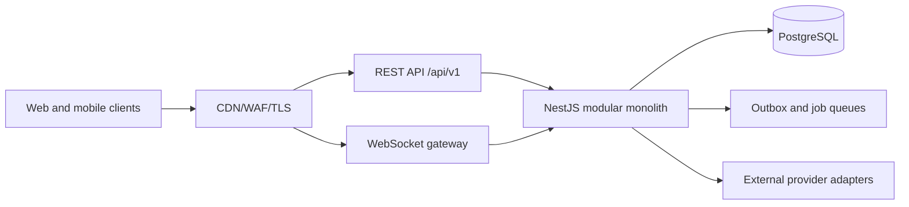

# AfriLink REST API Design

**Status:** Draft — derived from the current architecture and database drafts
**Date:** 2026-09-13
**Base path:** `/api/v1`
**Format:** JSON over HTTPS; WebSocket gateway only for selected realtime delivery

> REST, OpenAPI, WebSockets, JWT access/refresh tokens, and the modular-monolith constraint are defined in `CLAUDE.md`. `PRD.md` is empty, so endpoint scope and product policies still require approval. This is a contract design, not application code or an OpenAPI implementation.

## 1. API goals

The API must provide one stable contract for the web and mobile clients while preserving backend module ownership. It should be:

- resource-oriented and predictable;
- secure by default, with authorization enforced server-side;
- efficient on low-bandwidth connections;
- safe to retry from mobile clients and background workers;
- explicit about visibility, moderation, and account state;
- independently evolvable through additive versioned changes.

The REST API is authoritative for commands and ordinary queries. WebSockets may notify clients of accepted messages or notification changes, but durable state is always read from PostgreSQL through the REST contract.

## 2. API boundary and module mapping



| API area | Owning module | Primary database schemas |
|---|---|---|
| Authentication and account | Identity & Access | `identity`, `audit` |
| Profiles, follows, blocks | Profiles & Connections | `social`, `identity` |
| Posts, comments, reactions | Posts & Comments | `content` |
| Home and community feeds | Feed | `feed`, read-only source contracts |
| Communities and memberships | Communities | `community` |
| Conversations and messages | Messaging | `messaging` |
| Notifications and preferences | Notifications | `notification` |
| Uploads and media | Media | `media` |
| Reports, cases, appeals | Moderation | `moderation`, `audit` |
| Platform operations | Admin & Audit | `admin`, `audit` |
| Search | Search | `search` plus source authorization checks |

Controllers must call application services. Controllers must not query another module's tables directly or bypass its policy checks.

## 3. HTTP conventions

### Base URL and headers

- Production base URL is environment-specific; clients use the relative path `/api/v1`.
- Require HTTPS outside local development.
- Request and response media type: `application/json; charset=utf-8`.
- Media bytes use signed object-storage URLs, not JSON body uploads through ordinary API requests.
- Recommended request headers:
	- `Authorization: Bearer <access-token>` for token-authenticated requests;
	- `Accept-Language` for localized messages where supported;
	- `X-Request-Id` as an optional client correlation ID, validated and replaced if unsafe;
	- `Idempotency-Key` for retryable commands.
- Responses include `X-Request-Id` and, where tracing is enabled, a trace correlation value.

### Resource identifiers

- Use opaque UUIDv7/ULID identifiers as documented by the database design.
- Never expose database sequence values or internal storage keys.
- Treat identifiers as case-sensitive unless the resource explicitly defines normalized lookup, such as handles.

### HTTP methods

| Method | Use |
|---|---|
| `GET` | Read a resource or collection; must not mutate state |
| `POST` | Create a resource or execute a non-idempotent-by-default command; use an idempotency key when retryable |
| `PUT` | Replace a client-owned complete representation only where defined |
| `PATCH` | Partially update a resource with explicit fields |
| `DELETE` | Request deletion, removal, leave, or revocation according to the resource contract |

Do not expose generic database CRUD. Every write maps to a domain use case with authorization and policy checks.

## 4. Response envelope

Successful single-resource responses use a stable envelope:

```json
{
	"data": {
		"id": "01J...",
		"type": "profile",
		"attributes": {},
		"relationships": {}
	},
	"meta": {
		"requestId": "req_..."
	}
}
```

Collection responses use cursor metadata:

```json
{
	"data": [],
	"meta": {
		"requestId": "req_...",
		"page": {
			"nextCursor": "opaque-cursor",
			"hasMore": true
		}
	}
}
```

Contract rules:

- Do not expose internal table names, database columns, secret metadata, or provider object keys.
- Use explicit response DTOs; never serialize ORM entities directly.
- Omit fields the caller is not authorized to see rather than returning sensitive null details.
- Timestamps are RFC 3339 UTC strings.
- Counts are labeled as derived values when they may be eventually consistent.
- Response shapes are additive within a version; clients must ignore unknown fields.

## 5. Error contract

All expected errors use a consistent shape:

```json
{
	"error": {
		"code": "VALIDATION_FAILED",
		"message": "The request could not be accepted.",
		"details": [
			{
				"field": "body",
				"reason": "required"
			}
		],
		"requestId": "req_..."
	}
}
```

Error codes are stable machine-readable identifiers. Messages are safe for display but may be localized at the client or API layer.

| HTTP status | Typical codes | Meaning |
|---:|---|---|
| `400` | `INVALID_REQUEST`, `INVALID_CURSOR` | Malformed or semantically invalid request |
| `401` | `AUTHENTICATION_REQUIRED`, `TOKEN_INVALID`, `TOKEN_EXPIRED` | Missing or invalid authentication |
| `403` | `FORBIDDEN`, `ACCOUNT_RESTRICTED`, `MFA_REQUIRED` | Authenticated but not permitted |
| `404` | `RESOURCE_NOT_FOUND` | Resource does not exist or is intentionally undiscoverable |
| `409` | `CONFLICT`, `DUPLICATE_ACTION`, `IDEMPOTENCY_CONFLICT` | Current state conflicts with the command |
| `413` | `PAYLOAD_TOO_LARGE` | Body or upload request exceeds policy |
| `415` | `UNSUPPORTED_MEDIA_TYPE` | Unsupported content type |
| `422` | `VALIDATION_FAILED`, `POLICY_REJECTED` | Valid HTTP request but rejected by domain rules |
| `429` | `RATE_LIMITED`, `OTP_ATTEMPTS_EXCEEDED` | Retry later according to `Retry-After` |
| `500` | `INTERNAL_ERROR` | Unexpected server error; details are never exposed |
| `503` | `DEPENDENCY_UNAVAILABLE`, `MAINTENANCE` | Temporary dependency or service unavailability |

Do not reveal whether an account, email, phone number, private profile, or moderation target exists when that would aid enumeration or abuse.

## 6. Authentication and authorization

### Authentication endpoints

| Method | Endpoint | Purpose | Auth |
|---|---|---|---|
| `POST` | `/auth/register` | Create an account | Public, rate-limited |
| `POST` | `/auth/login` | Authenticate with approved credential | Public, rate-limited |
| `POST` | `/auth/refresh` | Rotate a refresh token | Refresh credential |
| `POST` | `/auth/logout` | Revoke current session | Authenticated |
| `POST` | `/auth/logout-all` | Revoke all sessions | Authenticated, re-auth as needed |
| `POST` | `/auth/verify` | Consume email/phone verification challenge | Public/session-bound |
| `POST` | `/auth/verification-challenges` | Request a verification challenge | Public/session-bound, rate-limited |
| `POST` | `/auth/password/forgot` | Start recovery | Public, rate-limited |
| `POST` | `/auth/password/reset` | Complete recovery | Challenge-bound |
| `GET` | `/auth/sessions` | List active sessions | Authenticated |
| `DELETE` | `/auth/sessions/{sessionId}` | Revoke one session | Authenticated |

Use short-lived access tokens, rotating refresh tokens stored as hashes, secure web cookies where selected, and OS-protected mobile storage. Administrator actions require stronger authentication and MFA.

### Authorization rules

Every use case evaluates:

1. authentication and account status;
2. resource ownership or permitted relationship;
3. profile/content/community visibility;
4. block and mute relationships;
5. moderation sanctions and content state;
6. scoped community or platform role;
7. data minimization and field-level disclosure.

Frontend route guards are not security controls. Resource-level authorization must be enforced on every API request.

## 7. Account and profile endpoints

| Method | Endpoint | Purpose |
|---|---|---|
| `GET` | `/me` | Return the authenticated user's safe account summary |
| `PATCH` | `/me` | Update allowed account preferences |
| `DELETE` | `/me` | Request account deletion |
| `GET` | `/profiles/{userIdOrHandle}` | Read a visibility-filtered profile |
| `PATCH` | `/me/profile` | Update the current profile |
| `GET` | `/me/preferences` | Read preferences |
| `PATCH` | `/me/preferences` | Update locale, privacy, accessibility, and discovery preferences |
| `GET` | `/me/relationships` | Read relationship state with another user when applicable |

Profile reads must apply blocks, account state, visibility, and moderation restrictions before serialization. Handle lookups are normalized according to the database design.

## 8. Social graph endpoints

| Method | Endpoint | Purpose |
|---|---|---|
| `POST` | `/users/{userId}/follow` | Follow a user; retryable with idempotency key |
| `DELETE` | `/users/{userId}/follow` | Unfollow a user |
| `GET` | `/users/{userId}/followers` | List permitted followers |
| `GET` | `/users/{userId}/following` | List permitted followees |
| `POST` | `/users/{userId}/block` | Block a user |
| `DELETE` | `/users/{userId}/block` | Remove a block |
| `GET` | `/me/blocks` | List current blocks |

Block mutations trigger suppression/invalidation jobs for feeds, search projections, notifications, and messaging visibility. A successful follow response describes the canonical relationship state rather than assuming immediate feed fan-out completion.

## 9. Posts, comments, and reactions

### Posts

| Method | Endpoint | Purpose |
|---|---|---|
| `POST` | `/posts` | Create a post |
| `GET` | `/posts/{postId}` | Read an authorized post |
| `PATCH` | `/posts/{postId}` | Edit an owned post according to edit policy |
| `DELETE` | `/posts/{postId}` | Soft-delete an owned post |
| `GET` | `/users/{userId}/posts` | List visible posts by a user |
| `GET` | `/communities/{communityId}/posts` | List visible community posts |

Create requests may include:

```json
{
	"body": "Post text",
	"visibility": "followers",
	"language": "en",
	"mediaIds": ["01J..."],
	"communityId": null
}
```

The API verifies media ownership/readiness, community membership, visibility policy, account state, content limits, and moderation requirements before committing the post and outbox event.

### Comments and reactions

| Method | Endpoint | Purpose |
|---|---|---|
| `POST` | `/posts/{postId}/comments` | Add a comment |
| `GET` | `/posts/{postId}/comments` | List comments by cursor |
| `PATCH` | `/comments/{commentId}` | Edit an owned comment |
| `DELETE` | `/comments/{commentId}` | Delete an owned comment |
| `PUT` | `/posts/{postId}/reaction` | Set the caller's reaction |
| `DELETE` | `/posts/{postId}/reaction` | Remove the caller's reaction |
| `PUT` | `/comments/{commentId}/reaction` | Set a comment reaction |
| `DELETE` | `/comments/{commentId}/reaction` | Remove a comment reaction |

Use `PUT` for a single caller-owned reaction state to make retries deterministic. Reaction and comment counters are derived and may be eventually consistent.

## 10. Feed endpoints

| Method | Endpoint | Purpose |
|---|---|---|
| `GET` | `/feed` | Read the authenticated user's home feed |
| `GET` | `/communities/{communityId}/feed` | Read a permitted community feed |
| `POST` | `/feed/rebuild` | Request a user feed rebuild when supported; normally internal/admin only |
| `POST` | `/posts/{postId}/hide` | Hide a feed item for the caller |

Query parameters:

- `cursor`: opaque cursor returned by the prior response;
- `limit`: bounded page size, with server default and maximum;
- optional approved filters such as `language` or `community`.

Feed assembly applies source visibility, account state, blocks, sanctions, community membership, hidden entries, and ranking policy at read time. Clients must not construct feed authorization from cached entries alone.

## 11. Community endpoints

| Method | Endpoint | Purpose |
|---|---|---|
| `POST` | `/communities` | Create a community |
| `GET` | `/communities` | Discover permitted communities |
| `GET` | `/communities/{communityId}` | Read a community summary |
| `PATCH` | `/communities/{communityId}` | Update an authorized community |
| `DELETE` | `/communities/{communityId}` | Request community deletion |
| `POST` | `/communities/{communityId}/join` | Join or request membership |
| `DELETE` | `/communities/{communityId}/membership` | Leave a community |
| `GET` | `/communities/{communityId}/members` | List permitted members |
| `PATCH` | `/communities/{communityId}/members/{userId}` | Change scoped membership state/role |
| `POST` | `/communities/{communityId}/invitations` | Issue an invitation |
| `POST` | `/community-invitations/{token}/accept` | Accept an invitation |
| `GET` | `/communities/{communityId}/moderation` | Read scoped moderation information |

Community owner/moderator permissions are scoped to the community. Platform roles cannot be granted through these endpoints. Private communities and pending memberships must not leak through discovery or error details.

## 12. Messaging endpoints

| Method | Endpoint | Purpose |
|---|---|---|
| `POST` | `/conversations` | Create or identify a permitted conversation |
| `GET` | `/conversations` | List the caller's conversations |
| `GET` | `/conversations/{conversationId}` | Read conversation metadata |
| `PATCH` | `/conversations/{conversationId}` | Update permitted title/mute settings |
| `POST` | `/conversations/{conversationId}/participants` | Add a permitted participant |
| `DELETE` | `/conversations/{conversationId}/participants/{userId}` | Leave/remove according to role |
| `GET` | `/conversations/{conversationId}/messages` | Read messages by cursor |
| `POST` | `/conversations/{conversationId}/messages` | Send a message |
| `PATCH` | `/messages/{messageId}` | Edit an allowed message |
| `DELETE` | `/messages/{messageId}` | Delete an allowed message |
| `POST` | `/conversations/{conversationId}/read` | Advance the caller's read cursor |
| `POST` | `/messages/{messageId}/report` | Report a message |

Message creation requires `Idempotency-Key` and/or a client message ID. REST commits the message; WebSockets deliver accepted events to connected participants. On reconnect, clients use message cursors and REST remains authoritative.

## 13. Notification endpoints

| Method | Endpoint | Purpose |
|---|---|---|
| `GET` | `/notifications` | List the caller's notifications |
| `POST` | `/notifications/{notificationId}/read` | Mark one notification read |
| `POST` | `/notifications/read` | Mark a bounded set or cursor range read |
| `GET` | `/notification-preferences` | Read channel/category preferences |
| `PATCH` | `/notification-preferences` | Update preferences |
| `POST` | `/devices` | Register a push device token through an adapter |
| `DELETE` | `/devices/{deviceId}` | Revoke a push device |

Notifications are created asynchronously from domain events. Delivery failure does not roll back the originating social action. Sensitive content is not included in push payloads by default.

## 14. Media and upload endpoints

| Method | Endpoint | Purpose |
|---|---|---|
| `POST` | `/media/uploads` | Reserve an upload and return a signed upload instruction |
| `POST` | `/media/uploads/{uploadId}/complete` | Confirm upload completion |
| `GET` | `/media/{mediaId}` | Read authorized media metadata |
| `DELETE` | `/media/{mediaId}` | Delete an owned/unreferenced media asset |
| `GET` | `/media/{mediaId}/variants/{variant}` | Obtain a short-lived delivery URL where authorized |

Upload flow:

1. Client requests an upload reservation with declared type, size, checksum, and purpose.
2. API authorizes the owner and returns a short-lived signed object-storage URL or multipart instructions.
3. Client uploads directly to private storage.
4. Client calls completion; the worker validates type/size/checksum, scans, strips unsafe metadata, and generates variants.
5. Content endpoints accept the media ID only after the asset is ready and policy-approved.

The API never trusts filename or client MIME type, and it never exposes private storage keys.

## 15. Search endpoints

| Method | Endpoint | Purpose |
|---|---|---|
| `GET` | `/search` | Search permitted users, communities, and public content |
| `GET` | `/search/users` | Search public profiles |
| `GET` | `/search/communities` | Search discoverable communities |
| `GET` | `/search/posts` | Search eligible public posts |

Search results are projections. Before returning a result, the API re-checks visibility, block state, account state, moderation state, and deletion state against source modules. Search terms, language, and result limits are bounded and rate-limited.

## 16. Reports and moderation endpoints

### User-facing

| Method | Endpoint | Purpose |
|---|---|---|
| `POST` | `/reports` | Report a profile, post, comment, message, or community |
| `GET` | `/me/reports` | Read the caller's permitted report status |
| `POST` | `/moderation-actions/{actionId}/appeal` | Submit an appeal where allowed |
| `GET` | `/me/appeals` | Read the caller's appeal status |

### Scoped moderator/admin

| Method | Endpoint | Purpose |
|---|---|---|
| `GET` | `/moderation/cases` | List assigned/scoped cases |
| `GET` | `/moderation/cases/{caseId}` | Read a case and controlled evidence |
| `PATCH` | `/moderation/cases/{caseId}` | Assign, prioritize, or transition a case |
| `POST` | `/moderation/cases/{caseId}/actions` | Apply a policy action |
| `POST` | `/moderation/actions/{actionId}/reverse` | Apply a reviewed reversal |
| `GET` | `/moderation/appeals` | List scoped appeals |
| `POST` | `/moderation/appeals/{appealId}/decision` | Decide an appeal |

Every moderation mutation records actor, scope, reason, duration, target, case, and audit correlation. The API must not expose evidence to users or roles without explicit permission.

## 17. Admin endpoints

Admin routes use the same versioned API but require administrator authentication, MFA, scoped permissions, and audit logging.

| Method | Endpoint | Purpose |
|---|---|---|
| `GET` | `/admin/users/{userId}` | Restricted user lookup |
| `POST` | `/admin/users/{userId}/actions` | Apply a scoped account action |
| `GET` | `/admin/audit-events` | Search permitted audit events |
| `GET` | `/admin/provider-health` | Read provider health and queue status |
| `GET` | `/admin/feature-flags` | Read feature flags |
| `PATCH` | `/admin/feature-flags/{flag}` | Change a feature flag with audit record |

No endpoint permits arbitrary SQL, direct database editing, secret retrieval, or unscoped role assignment.

## 18. Pagination and filtering

Use cursor pagination for all potentially large collections:

- cursor values are opaque, signed or integrity-protected, and encode a stable ordering such as `(created_at, id)`;
- cursors are resource-, user-, filter-, and version-specific;
- reject malformed, expired, or mismatched cursors with `INVALID_CURSOR`;
- enforce server-side maximum limits;
- do not use offset pagination for feeds, messages, notifications, followers, or audit events;
- filtering and sorting allowlists are defined per endpoint, never passed directly to SQL.

For an empty or exhausted collection, return `data: []`, `hasMore: false`, and no sensitive hints about inaccessible records.

## 19. Idempotency and concurrency

Require `Idempotency-Key` for retryable commands including:

- registration and verification requests where appropriate;
- follow/block mutations;
- post/comment creation;
- message creation;
- upload reservation/completion;
- community membership requests;
- moderation actions and appeals;
- account deletion requests.

The server stores the key, command type, request fingerprint, status, and safe response reference in `integration.idempotency_keys`. Reusing a key with a different request returns `IDEMPOTENCY_CONFLICT`.

Use optimistic concurrency for editable resources. Clients may send `If-Match`/entity versions where lost updates matter. State transitions must be validated against the current database state in a transaction.

## 20. Rate limits and abuse controls

Apply layered limits by IP, account, device, endpoint, target resource, and credential destination. High-risk limits include:

- registration, login, password recovery, and OTP;
- follows, messages, posts, comments, reactions, and invitations;
- reports, search, media uploads, and signed URL issuance;
- admin login and sensitive actions.

Return `429` with `Retry-After` and a safe error code. Redis may hold counters and windows, but durable security events and account state belong in PostgreSQL.

Add anti-automation controls, duplicate-content detection, account reputation signals, and provider cost controls as abuse patterns become known.

## 21. Security requirements

- Enforce TLS, secure headers, strict CORS, and CSRF protection for cookie-authenticated state changes.
- Validate every body, path parameter, query parameter, content type, and upload instruction.
- Use resource-level authorization to prevent IDOR and privilege escalation.
- Return generic errors for authentication, account enumeration, private resources, and moderation targets where needed.
- Redact access tokens, credentials, message bodies, report text, and sensitive PII from logs and traces.
- Apply response field filtering by caller and role.
- Protect WebSocket handshake and subscription authorization with the same session and resource policies.
- Require MFA and recent re-authentication for sensitive administrator actions.
- Audit authentication, authorization failures, role changes, exports, deletion, moderation, and configuration changes.

## 22. WebSocket boundary

WebSockets are not a second write API. Supported events may include:

- `message.accepted`;
- `message.updated`;
- `message.deleted`;
- `conversation.read`;
- `notification.created`;
- `presence.changed` and `typing.changed` as ephemeral events if approved.

Rules:

- Authenticate during connection and authorize each conversation/channel subscription.
- Send only events the connection is currently allowed to see.
- Include event ID, type, resource ID, version, and server timestamp.
- Support reconnect and replay from a cursor where durable events are required.
- Treat presence and typing as best-effort Redis-backed signals, never durable state.
- Clients must recover from missed events through REST.

## 23. External provider boundaries

Provider adapters are internal to the relevant module. The public API exposes normalized states, not vendor payloads.

- Identity adapters normalize email/SMS/OTP delivery and verification.
- Notification adapters normalize push/email/SMS delivery status.
- Media adapters normalize signed uploads and processing outcomes.
- Moderation adapters normalize automated safety signals.

Provider failures should enqueue retries or return a safe temporary-unavailable response. A provider outage must not cause an inconsistent committed social action when the provider is nonessential.

## 24. Versioning and compatibility

- Current public version is `/api/v1`.
- Breaking changes require a new major path or an approved versioning strategy.
- Additive fields and endpoints are preferred within a version.
- Deprecations require documentation, telemetry, a migration period, and client communication.
- Error codes and pagination semantics remain stable within a major version.
- Database migrations use expand-and-contract so old and new API versions can coexist during deployment.

## 25. OpenAPI and contract governance

The API should publish an OpenAPI document generated from reviewed DTOs and endpoint metadata. The contract must include:

- authentication schemes and required scopes/roles;
- request and response schemas;
- error codes and status behavior;
- pagination and idempotency headers;
- visibility and moderation state semantics;
- examples that contain no real personal data;
- deprecation and version metadata.

Required contract tests:

1. controller validation tests;
2. authorization matrix tests;
3. response schema and serialization tests;
4. idempotent retry tests;
5. cursor and filter tests;
6. database integration tests for transaction/outbox behavior;
7. client compatibility tests for web and mobile consumers.

## 26. Observability and operations

Every request should be traceable through:

- request ID and trace ID;
- authenticated actor classification, not unnecessary PII;
- route template, status, latency, and error code;
- database/query and external-provider timing;
- queue/outbox correlation for asynchronous work.

Track API availability, p50/p95/p99 latency, error rates by code, authorization failures, rate-limit events, pagination depth, queue lag, upload failures, message delivery, notification delivery, and moderation response time.

Do not record raw request bodies, access tokens, passwords, message content, report text, or private media URLs in normal logs.

## 27. API risks and decisions required

| Risk/decision | Impact | Required decision |
|---|---|---|
| Empty PRD | Endpoint scope may change | Approve MVP resources and acceptance criteria |
| No approved stack | Contract tooling may change | Confirm backend/framework and OpenAPI tooling |
| Identity method | Auth endpoints and provider cost vary | Choose email, phone, social login, or combination |
| Visibility policy | Affects every read endpoint | Approve public, follower, community, and private rules |
| Message retention | Affects API deletion/export semantics | Define retention and evidence rules |
| Upload limits | Affects clients and storage cost | Set file types, sizes, quotas, and processing SLAs |
| Localization | Affects errors, search, and response fields | Confirm initial languages and regional requirements |
| Mobile scope | Affects offline/idempotency priority | Confirm mobile MVP and supported platforms |

## 28. Recommended implementation order

1. Approve the PRD, MVP resources, identity policy, visibility model, and moderation policy.
2. Confirm the technology stack and add the API conventions to `CLAUDE.md` or an ADR.
3. Define OpenAPI schemas for authentication, profiles, posts, feed, communities, and reports.
4. Implement authorization and error/pagination middleware before feature endpoints.
5. Implement transactional commands with database constraints, idempotency, and outbox events.
6. Add messaging, media, notifications, search, and admin contracts incrementally.
7. Add contract, security, abuse, load, and client compatibility tests.
8. Publish a versioned API reference and deprecation policy before external or mobile integration.

No endpoint implementation should begin until the product scope and unresolved policy decisions are approved.
